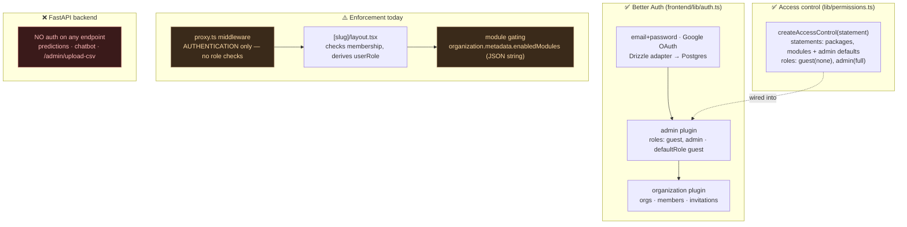
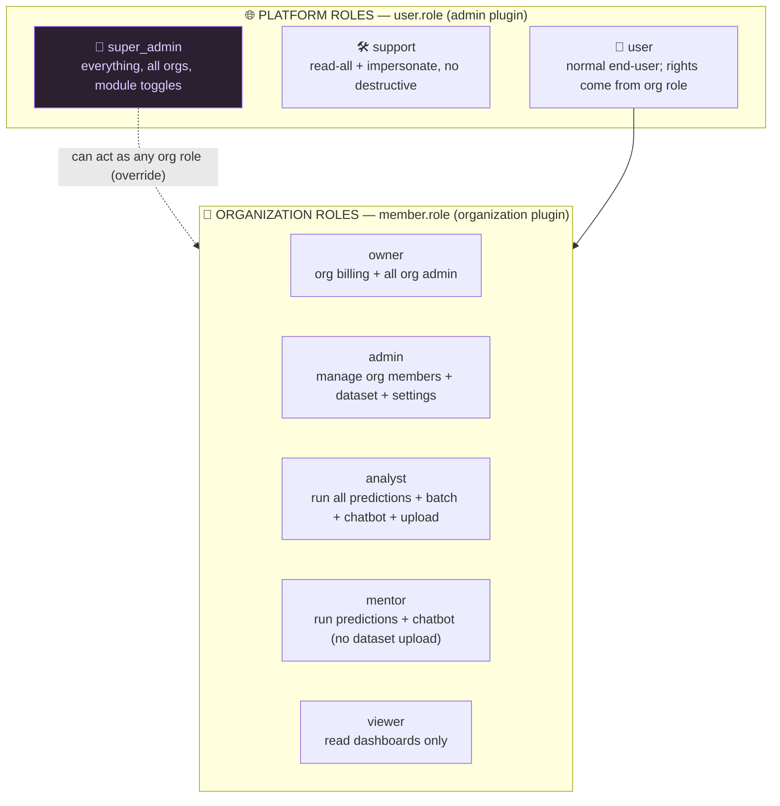
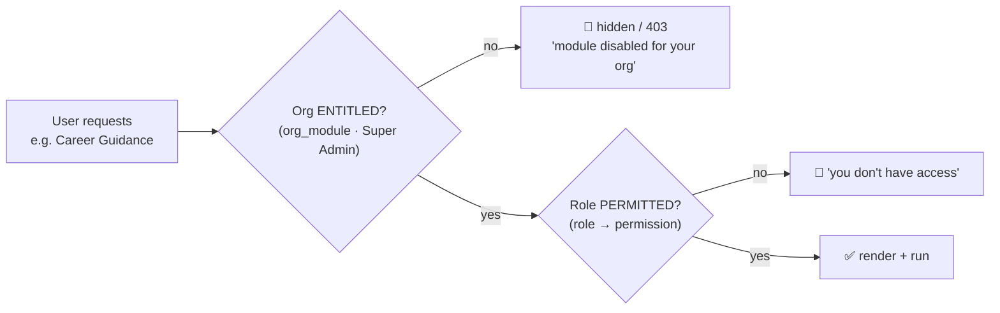
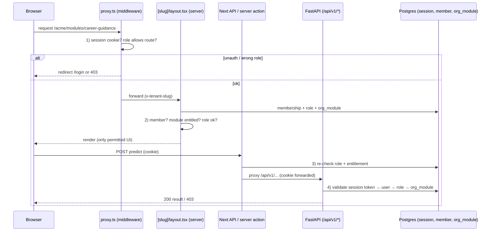
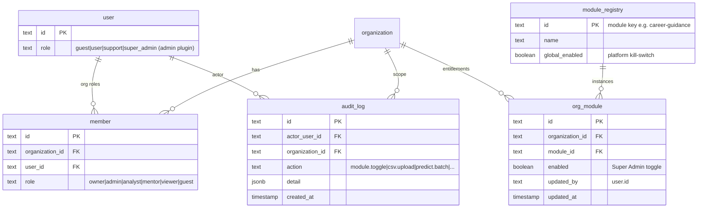

# 🔐 AI Mentor — Role-Based Access Control (RBAC) Plan

> A deep analysis of the current authentication/authorization state and a complete,
> phased plan to implement a **two-tier RBAC** across the whole platform: a global
> **Super Admin** who controls everything (including turning each module on/off per
> organization), plus a researched set of organization-level roles.
>
> Grounded in the actual code: `frontend/lib/auth.ts`, `frontend/lib/permissions.ts`,
> `frontend/proxy.ts`, `frontend/lib/tenant.ts`, `frontend/app/(tenant-app)/[slug]/layout.tsx`,
> `frontend/db/schema/auth-schema.ts`, and the FastAPI backend under `backend/app`.

---

## 1. Executive summary

| Goal | Decision |
|---|---|
| **Super Admin** | A platform-level role (`user.role = 'super_admin'`) that bypasses all org checks, sees every organization, and can toggle each module on/off per org (and globally). |
| **Other roles** | Two tiers — **Platform roles** (on `user.role`) and **Organization roles** (on `member.role`) — see §4. |
| **Module on/off** | Promote `enabledModules` from a JSON blob in `organization.metadata` to a first-class **`org_module`** table the Super Admin controls; enforced at every layer. |
| **Biggest fix** | The **FastAPI backend currently has no auth** — §7 closes this (it must validate the session and enforce role + module entitlement). |
| **Strategy** | **Defense in depth**: middleware → server layout → Next API routes → FastAPI, every layer re-checks. Plus an **audit log**. |

---

## 2. Current state (what already exists)



**Assets to build on**
- `user.role` (default `guest`) — the **platform** role dimension (Better Auth `admin` plugin).
- `member.role` (default `member`) — the **organization** role dimension (Better Auth `organization` plugin).
- `lib/permissions.ts` — an `accessControl` object already declares `packages` and `modules` resources; only `guest` and `admin` roles are defined.
- `organization.metadata.enabledModules` — current per-org module list (consumed by `getTenantContext`, `useModuleAccess`, and `TenantSidebar`).
- `session.impersonatedBy` column already exists → **impersonation** is available for Super Admin.
- A platform console already exists at `/dashboard/admin`, `/dashboard/admin/packages`, `/dashboard/admin/pricing`.

**Gaps**
1. `proxy.ts` only verifies a session **token exists** — it never checks roles, so `/dashboard/admin` is reachable by *any* logged-in user.
2. Module list is an unvalidated **JSON string**, editable only by hand; no UI, no per-role rules, no audit.
3. **FastAPI is completely open** — the real authorization boundary (predictions, dataset upload) is unprotected.
4. Only two roles exist (`guest`, `admin`); no Super Admin, no analyst/viewer separation.
5. No **audit trail** of who toggled what / ran what.

---

## 3. Research: how multi-tenant SaaS RBAC is normally modeled

Industry pattern (Auth0, WorkOS, Better Auth org plugin, typical B2B SaaS):

- **Two role planes.** A *platform/system* plane (staff who run the SaaS) and a *tenant/organization* plane (customer users). A user has **one platform role** and **one role per organization** they belong to. This repo already has both columns — we lean into it.
- **Resource × action permissions**, grouped into roles (RBAC), with optional per-resource overrides (ABAC-lite) — Better Auth's `createAccessControl` already supports `resource: [actions]`.
- **Entitlements (modules/features) are separate from roles.** Whether an org *has* a module (commercial/feature flag) is distinct from whether a *role* may use it. We model both: **org entitlement** (Super-Admin-controlled) ∩ **role permission** (built into the role).
- **Deny by default**; every layer re-checks (defense in depth); **audit everything** sensitive.
- **Least privilege**: most users get read/run, few get manage.

---

## 4. Proposed role model

### 4.1 Two tiers



### 4.2 Role definitions

| Tier | Role | Who | Core rights |
|---|---|---|---|
| Platform | **`super_admin`** 👑 | Platform operator (you) | Full access to every org and the platform console. Create/suspend orgs, manage packages & pricing, **toggle any module on/off for any org**, manage all users, ban, impersonate, view audit logs. Bypasses all org-membership checks. |
| Platform | **`support`** | Support staff | Read-only across orgs + impersonate to reproduce issues. No destructive actions, no module toggles, no billing. |
| Platform | **`user`** | Everyone else | No platform powers; effective rights come entirely from their **organization role(s)**. (Replaces today's `guest` default once approved; `guest` kept for "pending approval".) |
| Org | **`owner`** | Org creator / billing contact | Everything `admin` can do **plus** subscription/billing and deleting the org. Exactly one per org (transferable). |
| Org | **`admin`** | Org administrator | Manage members & invitations, upload/replace the dataset, change org settings, use all enabled modules. Cannot change which modules the org is entitled to (that's Super Admin). |
| Org | **`analyst`** | Power analyst | Run every enabled prediction (single + **batch/cohort**), use the chatbot, upload datasets. No member management. |
| Org | **`mentor`** | Counselor / teacher | Run single-student predictions + chatbot for enabled modules. **No** dataset upload, **no** cohort/batch export. |
| Org | **`viewer`** | Read-only stakeholder | View dashboards/results that already exist; cannot run predictions or upload. |
| Org | **`guest`** | Pending/unapproved | No access; sees an "awaiting approval" screen. |

> **Why these org roles?** They map cleanly onto the product surface: *dataset* (upload), *single prediction*, *cohort/batch*, *chatbot*, *member management*, *billing*. `analyst` vs `mentor` vs `viewer` is the standard run-everything / run-single / read-only split; `owner`/`admin` is the standard billing-vs-operations split.

---

## 5. Super Admin — module on/off control (the headline feature)

The Super Admin must turn each **module** on/off per organization (and globally). We separate **two independent gates**, both of which must be open for a user to use a module:



- **Gate 1 — Org entitlement (Super Admin controlled):** a new **`org_module`** table (one row per org × module) with `enabled: boolean`. Super Admin flips these from a console. A "kill switch" (`module_registry.global_enabled`) can disable a module platform-wide for maintenance.
- **Gate 2 — Role permission:** built into the role (e.g. `viewer` can't run predictions even if the module is on).

**Modules registry** (single source of truth): `grade-prediction`, `career-guidance`, `subject-prediction`, `growth-potential`, `ai-chatbot`, `batch-prediction`. (Today `batch-prediction` is hard-coded always-on in the sidebar — it becomes a normal toggle.)

**Super Admin module console** (`/dashboard/admin/orgs/[id]/modules`):
- A grid of orgs × modules with toggles; bulk enable/disable; "apply package defaults"; global kill-switch per module; every toggle writes an **audit log** row.

---

## 6. Permission matrix

Resources × actions, mapped to roles. ✅ = allowed, 🔵 = own-org only, ➖ = no. (Platform roles act across **all** orgs; org roles are scoped to their org and gated by `org_module`.)

| Resource / Action | super_admin | support | owner | admin | analyst | mentor | viewer |
|---|:--:|:--:|:--:|:--:|:--:|:--:|:--:|
| **Platform** |||||||| 
| Manage packages / pricing | ✅ | ➖ | ➖ | ➖ | ➖ | ➖ | ➖ |
| Create / suspend organizations | ✅ | ➖ | ➖ | ➖ | ➖ | ➖ | ➖ |
| **Toggle module on/off (org_module)** | ✅ | ➖ | ➖ | ➖ | ➖ | ➖ | ➖ |
| Global module kill-switch | ✅ | ➖ | ➖ | ➖ | ➖ | ➖ | ➖ |
| Manage any user / ban | ✅ | ➖ | ➖ | ➖ | ➖ | ➖ | ➖ |
| Impersonate user | ✅ | ✅ | ➖ | ➖ | ➖ | ➖ | ➖ |
| View audit log | ✅ | ✅ (read) | 🔵 | 🔵 | ➖ | ➖ | ➖ |
| **Organization** |||||||| 
| View billing / subscription | ✅ | 🔵 | 🔵 | ➖ | ➖ | ➖ | ➖ |
| Manage members / invites | ✅ | ➖ | 🔵 | 🔵 | ➖ | ➖ | ➖ |
| Edit org settings | ✅ | ➖ | 🔵 | 🔵 | ➖ | ➖ | ➖ |
| **Data & Intelligence** (also requires `org_module` ON) |||||||| 
| Upload / replace dataset (CSV) | ✅ | ➖ | 🔵 | 🔵 | 🔵 | ➖ | ➖ |
| Run single prediction (any module) | ✅ | 🔵 | 🔵 | 🔵 | 🔵 | 🔵 | ➖ |
| Run **batch/cohort** prediction | ✅ | 🔵 | 🔵 | 🔵 | 🔵 | ➖ | ➖ |
| Use AI Chatbot | ✅ | 🔵 | 🔵 | 🔵 | 🔵 | 🔵 | ➖ |
| View dashboards / results | ✅ | 🔵 | 🔵 | 🔵 | 🔵 | 🔵 | 🔵 |

> This matrix becomes the literal content of `lib/permissions.ts` roles and the FastAPI permission checks (§7, §9).

---

## 7. Enforcement architecture — defense in depth

Every request passes up to four checkpoints. The **FastAPI checkpoint is new and essential** — it's where the real ML/data actions happen.



### 7.1 Layer 1 — Middleware (`proxy.ts`)
Add role/route rules (coarse, fast, cookie-only):
- `/dashboard/admin/**` → require `user.role ∈ {super_admin, support}` (decode role from session; see note).
- Tenant routes → keep auth check; defer fine-grained role/module checks to the layout (middleware can't cheaply hit the DB).
- *Note:* Edge middleware shouldn't query Postgres. Use a lightweight signed session claim (Better Auth **JWT plugin**, §7.5) or a `role` cookie set at login to gate `/dashboard/admin` cheaply, then re-verify server-side.

### 7.2 Layer 2 — Server layout / pages
- `[slug]/layout.tsx` already loads membership → extend it to also load **`org_module`** + the user's **platform role**, put both into `TenantInfo`, and **redirect/forbid** when membership/role is insufficient.
- Each module page guards with a server check `can(user, "predict:career", { org })` before rendering.

### 7.3 Layer 3 — Next API routes / server actions
- Every mutating route (`/api/tenant/*`, package/pricing actions, module-toggle action) calls a shared `requirePermission(...)` helper using `auth.api.getSession()` + the permission matrix.

### 7.4 Layer 4 — FastAPI (the critical addition)
The browser calls `/api/v1/*`, which Next rewrites to `:8001` **forwarding the session cookie**. So FastAPI can authenticate by validating that cookie. **Two options:**

| Option | How | Verdict |
|---|---|---|
| **A. Shared-DB session validation** (recommended now) | FastAPI reads the `better-auth.session_token` cookie, looks it up in the **`session`** table (same Postgres), checks expiry, loads `user.role` + `member.role` + `org_module`. A FastAPI dependency `require(perm)` enforces the matrix. | ✅ Simplest; no new infra; works with current proxy. Adds 1 indexed query per request (cache 30s). |
| **B. JWT + JWKS** (scale later) | Enable Better Auth **`jwt` plugin** → mint a short-lived JWT with `role`/`org`/`modules` claims; FastAPI verifies via JWKS (`/api/auth/jwks`) with `PyJWT`. | Stateless, scales, but more moving parts; do this when backend scales out. |

**Recommended:** ship **A** now (closes the open-backend hole immediately), keep **B** as the scale path. A FastAPI dependency example:

```python
# backend/app/auth/deps.py  (new)
async def require(permission: str):
    async def _dep(request: Request):
        principal = await resolve_principal(request)        # validate cookie → user, roles, org
        if not principal:
            raise HTTPException(401, "Not authenticated")
        if not has_permission(principal, permission):       # matrix from §6
            raise HTTPException(403, "Forbidden")
        return principal
    return _dep

# usage
@router.post("/batch/predict", dependencies=[Depends(require("predict:batch"))])
```

### 7.5 Where the role claim lives
- Add `super_admin`/`support` to the Better Auth `admin` plugin roles in `lib/auth.ts`.
- Optionally enable the **`jwt` plugin** so middleware/FastAPI can read role from a verifiable token instead of a DB hit.

---

## 8. Data model changes

### 8.1 New / changed tables (Drizzle — platform DB)



Changes:
1. **`user.role`** — extend allowed values: `guest | user | support | super_admin` (string already; enforce in app).
2. **`member.role`** — extend: `owner | admin | analyst | mentor | viewer | guest`.
3. **`module_registry`** — seed the 6 modules; `global_enabled` kill-switch.
4. **`org_module`** — the per-org toggle the Super Admin owns; **replaces** `organization.metadata.enabledModules` (migrate existing JSON → rows, then keep metadata read-only/legacy).
5. **`audit_log`** — append-only record of sensitive actions.

### 8.2 Backend (intelligence DB)
- The backend already shares Postgres, so it can **read** `session`, `member`, `org_module` directly for Option A. No backend schema change required for auth itself.
- *(Ties into `db.md` §10 gap #1:)* if/when the shared `students` table gets an `organization_id`, the same principal resolution scopes predictions to the caller's org. Until then, all orgs share one dataset and only the **action** is gated, not the **data**.

### 8.3 `lib/permissions.ts` (rewrite roles)
Expand `statement` with real resources and define every role from the §6 matrix:

```ts
export const statement = {
  ...defaultStatements,
  packages: ["create","read","update","delete","list"],
  modules:  ["read","list","toggle"],               // toggle = Super Admin
  org:      ["read","update","delete","manageMembers","billing"],
  dataset:  ["upload","read"],
  predict:  ["single","batch"],
  chatbot:  ["use"],
  audit:    ["read"],
} as const;
// roles: superAdmin, support, owner, admin, analyst, mentor, viewer, guest
```

---

## 9. Backend protection plan (FastAPI)

| Endpoint group | Required permission |
|---|---|
| `POST /api/v1/admin/upload-csv` | `dataset:upload` (admin/analyst/owner or super_admin) |
| `POST /api/v1/prediction/{sgpa,career,9box,subject}` (single) | `predict:single` + module entitled |
| `*/batch/*`, `/prediction/csv/*/batch` | `predict:batch` + module entitled |
| `POST /api/v1/chat/` | `chatbot:use` + `ai-chatbot` entitled |
| `GET /health`, `/docs` | open (no PII) — or lock `/docs` in prod |

Implementation: a new `backend/app/auth/` package (`principal.py` to resolve the cookie→user→roles→entitlements with a short TTL cache; `deps.py` with `require(permission)`; `matrix.py` mirroring §6). Wire `dependencies=[Depends(require(...))]` onto each router/route. Add a small in-process cache (30–60s) keyed by session token to avoid a DB hit per call.

---

## 10. Super Admin console (UI)

Extend the existing `/dashboard/admin`:

| Page | Purpose |
|---|---|
| `/dashboard/admin` | Platform overview: orgs, users, active modules, recent audit events. |
| `/dashboard/admin/orgs` | List/create/suspend organizations; assign owner. |
| `/dashboard/admin/orgs/[id]/modules` | **Module on/off grid** (the headline): per-module toggles, "apply package defaults", global kill-switch. |
| `/dashboard/admin/orgs/[id]/members` | Manage members + org roles; invite. |
| `/dashboard/admin/users` | All users; set platform role; ban; **impersonate** (uses `session.impersonatedBy`). |
| `/dashboard/admin/packages`, `/pricing` | Already exist — gate them behind `super_admin`. |
| `/dashboard/admin/audit` | Searchable audit log. |

All of these are gated by `user.role ∈ {super_admin}` (audit read also `support`).

---

## 11. Implementation roadmap (phased)

| Phase | Scope | Outcome | Risk |
|---|---|---|---|
| **0 — Roles & seed** | Add `super_admin`/`support` to `lib/auth.ts` + `lib/permissions.ts`; seed the first super admin (script). Extend `member.role` values. | Roles exist; you are super admin. | Low |
| **1 — Lock the doors** | `proxy.ts`: gate `/dashboard/admin/**` by role. `requirePermission()` helper for Next API routes/server actions. | Console no longer open to any logged-in user. | Low |
| **2 — Module entitlements** | Create `module_registry` + `org_module` + migration from `metadata.enabledModules`; update `getTenantContext`/`layout`/sidebar to read `org_module`; build the Super Admin **module toggle grid**. | Super Admin controls modules on/off per org. | Medium |
| **3 — Secure the backend** | FastAPI `auth/` package (Option A): resolve principal from cookie, `require()` deps on every endpoint, mirror the matrix. | The real boundary (predictions, upload) is enforced. | **High value** |
| **4 — Org roles in UI** | Enforce `analyst/mentor/viewer` in tenant pages (hide run/upload buttons; server-guard). Member-management UI with role assignment. | Least-privilege inside orgs. | Medium |
| **5 — Audit + polish** | `audit_log` table + writes on sensitive actions; audit viewer; optional JWT plugin (Option B); lock `/docs` in prod. | Traceability + scale path. | Low |

**Suggested order to ship value fast:** Phase 0 → 1 → 3 (close the open backend) → 2 (module toggles) → 4 → 5.

---

## 12. Seeding the first Super Admin

```sql
-- after the role values are allowed in app code
UPDATE "user" SET role = 'super_admin' WHERE email = 'oxford@gmail.com';
```
Or a `scripts/make-super-admin.mjs` mirroring `create-oxford-user.mjs`. Document in `RUN_THE_PROJECT.md`.

---

## 13. Security considerations & edge cases

- **Deny by default** everywhere; an unknown role gets `guest` rights.
- **Re-validate server-side** — never trust the client's hidden/disabled buttons; the FastAPI check (§9) is the true gate.
- **Impersonation** must be audited (`session.impersonatedBy` + `audit_log`) and time-boxed; support cannot impersonate super_admin.
- **Module kill-switch** beats org entitlement (maintenance overrides commerce).
- **Cookie forwarding**: confirm the Next rewrite forwards `Cookie` to `:8001` (it does for same-origin `/api/v1/*`); in production set `useSecureCookies` + correct `sameSite`.
- **`/docs` & `/openapi.json`** expose the API surface — gate or disable in production.
- **Token cache TTL** (FastAPI) must be short (≤60s) so role/entitlement changes take effect quickly; invalidate on toggle.
- **Tenant data isolation** (see `db.md` §10 #1) is a *separate* gap: RBAC gates *actions*; until `students` has `organization_id`, it does not isolate *data* between orgs.

---

## 14. Testing matrix (acceptance)

| As | Try | Expect |
|---|---|---|
| super_admin | open `/dashboard/admin`, toggle a module off for org A | grid loads; org A loses that module instantly (sidebar + 403 on its API) |
| support | open module toggle | 403; can read audit + impersonate |
| org admin | upload CSV | ✅; toggle module | ✅ hidden/403 |
| analyst | run batch | ✅; manage members | ✅ hidden/403 |
| mentor | run single | ✅; run batch / upload | 403 |
| viewer | view dashboard | ✅; run prediction | 403 |
| any role | direct `curl` to `:8001/api/v1/prediction/...` without/with wrong cookie | 401/403 |
| disabled module | call its API while `org_module.enabled=false` | 403 "module disabled" |

---

## 15. File-by-file change map

| Area | File(s) | Change |
|---|---|---|
| Roles | `frontend/lib/auth.ts` | add `super_admin`, `support` to admin plugin roles |
| Permissions | `frontend/lib/permissions.ts` | expand `statement`; define all 8 roles from §6 |
| Middleware | `frontend/proxy.ts` | gate `/dashboard/admin/**` by role; keep tenant auth |
| Tenant context | `frontend/lib/tenant.ts`, `hooks/use-tenant.tsx`, `app/(tenant-app)/[slug]/layout.tsx` | read `org_module` + platform role; expose in `TenantInfo`; server-guard pages |
| Schema | `frontend/db/schema/*.ts` + migration | `module_registry`, `org_module`, `audit_log`; role value docs |
| Module gating | `components/dashboard/tenant-sidebar.tsx` | filter by `org_module` (drop hard-coded batch-prediction) |
| Super Admin UI | `app/(dashboard)/dashboard/admin/**` | orgs, module grid, users, audit; gate by role |
| Next guards | `app/api/**`, `actionts/**` | `requirePermission()` on mutations |
| **Backend auth** | `backend/app/auth/{principal,deps,matrix}.py` (new) | resolve cookie→principal; `require()` deps |
| Backend routers | `backend/app/modules/**/router.py`, `chatbot/router.py`, `chatbot/admin_router.py`, `main.py` | attach `Depends(require(...))` |
| Seed | `scripts/make-super-admin.mjs`, `RUN_THE_PROJECT.md` | first super admin |

---

## 16. TL;DR

- **Super Admin** = `user.role = 'super_admin'`: sees/controls everything, and flips each module **on/off per org** via a new `org_module` table + a console grid (with a global kill-switch).
- **Other roles**: platform `support`/`user`; org `owner`/`admin`/`analyst`/`mentor`/`viewer`/`guest` — a researched least-privilege split across dataset upload, single vs batch prediction, chatbot, and org management (full matrix in §6).
- **A module is usable only if `org_module.enabled` (Super Admin) AND the role permits it.**
- **The must-fix**: the **FastAPI backend is currently open** — Phase 3 validates the shared session cookie and enforces the matrix there. That's where authorization actually has to live.
- Build it in phases (§11); start by making yourself super admin and locking `/dashboard/admin`, then secure the backend, then ship the module toggles.

*Generated from a full read of the auth, middleware, tenant, schema, and backend code. Pair with `db.md` (schema) — RBAC §8 adds the `module_registry`/`org_module`/`audit_log` tables noted there.*
