# 🧠 AI Mentor — System Work & Architecture

> A multi-tenant SaaS that turns a 10,000-row student dataset into **live ML predictions**,
> **cohort analytics**, and a **RAG chatbot**. This document is generated from the actual
> codebase and is meant to get a new developer productive in **10–15 minutes**.

---

## Project Overview

| | |
|---|---|
| **Purpose** | Help universities predict & guide student outcomes (grades, careers, subjects, growth) from a shared dataset. |
| **Core features** | 4 single-student predictors · batch/cohort analytics · AI chatbot · CSV mode · multi-tenant orgs · two-plane RBAC · super-admin console. |
| **Main modules** | Grade (SGPA) · Career · Subject · Growth (9-Box) · Batch Prediction · AI Chatbot. |
| **Stack** | **Frontend:** Next.js 16 (App Router, React 19 compiler, Turbopack), Better Auth, Drizzle ORM. **Backend:** FastAPI (Py 3.11), CatBoost + SHAP, pgvector, Ollama (`phi3:mini`). **Infra:** Docker Compose. |
| **User workflow** | Log in → pick a module → enter inputs (or pick a student / upload CSV) → run → dashboards, charts, insights & recommendations render live. |

**Ports:** Frontend `:3000` · Backend `:8001` (Swagger `/docs`) · Postgres `:5433` · Ollama `:11434`.

---

## System Architecture

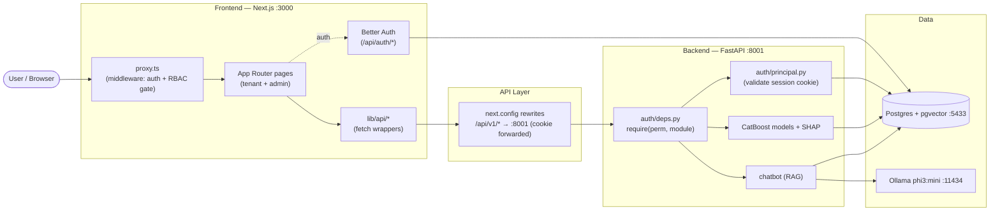

The **same Postgres** backs Better Auth (frontend) **and** FastAPI authorization — the backend
reads the forwarded `better-auth.session_token` cookie against the shared `session` table.

---

## Folder Structure

```text
AI-updates-mentor/
├── frontend/                      # Next.js app (App Router)
│   ├── app/
│   │   ├── (tenant-app)/[slug]/   # Per-org tenant UI (modules live here)
│   │   ├── (dashboard)/dashboard/admin/  # Super-admin console
│   │   ├── (landing)/ (auth)/     # Marketing + login/register
│   │   └── api/                   # Next route handlers (auth, tenant)
│   ├── components/                # UI: modules/, grade-prediction/, dashboard/, ui/
│   ├── lib/                       # api/ (fetch), auth.ts, rbac.ts, permissions.ts
│   ├── db/schema/                 # Drizzle tables (auth, rbac, packages)
│   ├── proxy.ts                   # Edge middleware (auth + admin gate + tenant routing)
│   └── next.config.ts             # /api/v1/* rewrite → FastAPI
├── backend/                       # FastAPI service
│   ├── app/
│   │   ├── main.py                # App + router wiring + permission deps
│   │   ├── auth/                  # principal.py, deps.py, matrix.py (RBAC)
│   │   ├── modules/<predictor>/   # router · services · schemas · training
│   │   ├── core/*_ml_engine.py    # CatBoost model loaders
│   │   └── chatbot/               # RAG: ingest, retrieval, Ollama client
│   ├── init.sql                   # students + chat tables (pgvector)
│   └── docker-compose.yml         # postgres · api · ollama
├── docs/screenshots/              # UI captures (see README)
└── SYSTEM_WORK.md                 # ← this file
```

| Folder | One-liner |
|---|---|
| `frontend/app/(tenant-app)` | Org-scoped pages — every prediction module dashboard. |
| `frontend/lib/api` | Typed `fetch` wrappers that call `/api/v1/*`. |
| `frontend/db/schema` | Drizzle table definitions (auth, RBAC, billing). |
| `backend/app/modules` | One folder per predictor: route → service → ML engine. |
| `backend/app/auth` | Shared-cookie auth + permission matrix (mirrors `lib/rbac.ts`). |
| `backend/app/chatbot` | CSV ingest + pgvector retrieval + Ollama generation. |

---

## User Journey Flow

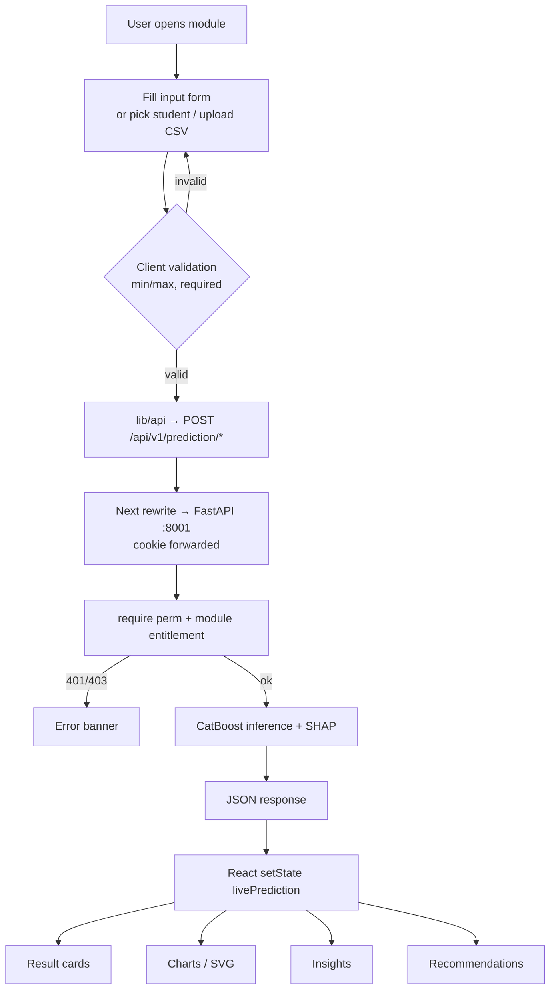

When a **new** prediction returns, `livePrediction` (and `liveInput` for grade) update, and
**every** dependent card/chart/insight re-derives from it — no stale data.

---

## Routing Map

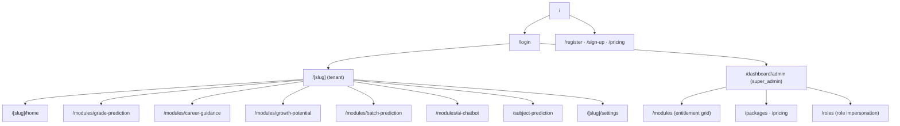

| Route | Page | Purpose |
|---|---|---|
| `/login`, `/register` | Auth | Email+password / Google sign-in. |
| `/[slug]/home` | Tenant dashboard | Org landing + KPIs. |
| `/[slug]/modules/grade-prediction` | Grade | SGPA prediction + analytics. |
| `/[slug]/modules/career-guidance` | Career | Career path + alternatives. |
| `/[slug]/subject-prediction` | Subject | Department recommendation. |
| `/[slug]/modules/growth-potential` | Growth | 9-Box performance×potential. |
| `/[slug]/modules/batch-prediction` | Batch | Cohort KPIs, prescriptions, forecast. |
| `/[slug]/modules/ai-chatbot` | Chatbot | RAG over the student dataset. |
| `/dashboard/admin/modules` | Admin | Per-org module on/off grid. |
| `/dashboard/admin/roles` | Admin | One-click role impersonation. |

---

## API Documentation

| Endpoint | Method | Purpose | Consumer |
|---|---|---|---|
| `/api/v1/prediction/sgpa/` | POST | Grade (SGPA) + SHAP factors | Grade module |
| `/api/v1/prediction/career/career` | POST | Career class + alternatives | Career module |
| `/api/v1/prediction/subject/subject_choice` | POST | Department + alternatives | Subject module |
| `/api/v1/prediction/9box/` | POST | 9-Box position + recommendation | Growth module |
| `/api/v1/prediction/batch/overview` | GET | Dataset KPIs | Batch module |
| `/api/v1/prediction/batch/predict` | POST | Cohort prediction table | Batch module |
| `/api/v1/prediction/batch/prescriptions` | POST | At-risk / Mid / On-track plans | Batch module |
| `/api/v1/prediction/batch/forecast` | POST | Trend forecast | Batch module |
| `/api/v1/prediction/csv/students` | GET | Search students (CSV mode) | Student picker |
| `/api/v1/prediction/csv/{module}/predict/{id}` | GET | Single prediction from dataset row | CSV mode |
| `/api/v1/prediction/csv/{module}/batch` | GET | Whole-cohort run | CSV batch view |
| `/api/v1/chat/` | POST | RAG chat turn | Chatbot |
| `/api/v1/admin/upload-csv` | POST | Re-ingest dataset (embeddings) | Upload card |
| `/api/v1/auth/whoami` | GET | Resolve principal (debug) | — |
| `/health` | GET | Liveness | Preflight |
| `/api/auth/*` | * | Better Auth (sign-in, session, org, admin) | Frontend auth |

All `/prediction/*`, `/chat`, `/admin/*` endpoints are gated by `Depends(require(perm, module))`.

---

## Database Documentation

- **Technology:** PostgreSQL 15 with **pgvector** (`pgvector/pgvector:pg15`).
- **Connection flow:** Frontend → Drizzle (`DATABASE_URL`, `:5433`). Backend → SQLAlchemy async (`postgresql+asyncpg`, in-network `:5432`). Both hit the **same** database (`ai_mentor`).
- **Two domains:** ML/chat tables (`students`, `chat_*`) + auth/RBAC/billing tables (Better Auth + Drizzle).

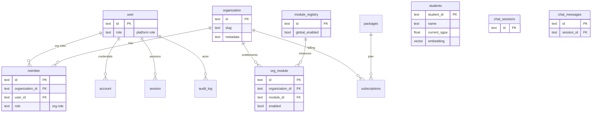

**Main tables:** `students` (10k rows + pgvector embedding), `chat_sessions`/`chat_messages`,
`user`/`session`/`account`/`organization`/`member`/`invitation`, `module_registry`/`org_module`/`audit_log`,
`packages`/`subscriptions`/`promotions`.

---

## Prediction Modules

| Module | Inputs | Output | Charts | Recommendations |
|---|---|---|---|---|
| **Grade (SGPA)** | SSC/HSC GPA, prev SGPA, study hrs, attendance, income, part-time, education, support, dept | `predicted_sgpa`, `risk_level`, top-5 SHAP `contributing_factors` | Trajectory SVG, impact-factor bars, factor cards | Risk band + factor-driven simulator |
| **Career** | personality, work env, interests, CGPA, 10 skill scores, projects, internship | `predicted_career`, `confidence_score`, `alternative_paths[]` | Competency radar, path bars | Top path + alternatives + learning modules |
| **Subject** | gender, age, HSC, study style, skills, interests, budget, goal | `recommended_department`, `confidence_score`, `alternative_options[]` | Confidence gauge, skill radar | Top dept + ranked alternatives + rationale |
| **Growth (9-Box)** | CGPA, attendance, 12 competency scores, internship | `nine_box_position_label`, `position_in_grid`, perf/potential levels, `descriptive_recommendation` | 9-Box grid, cohort breakdown | Box recommendation + retention + action plan |
| **Batch** | cohort filters (dept, category, gender, min hrs/att) | KPIs, prediction table, prescriptions, forecast | KPI cards, scatter, bar/area | At-risk / Mid / On-track prescriptions |
| **Chatbot** | natural-language query | grounded answer + cited students | — | Conversational guidance |

```mermaid
flowchart LR
    F["Input form / picker / CSV"] --> V[Validate]
    V --> R["lib/api/predictions.ts"]
    R --> X["/api/v1/prediction/{module}"]
    X --> S["services.py: build feature frame"]
    S --> E["CatBoost engine (.cbm)"]
    E --> H["SHAP / class probs"]
    H --> J[JSON response]
    J --> ST[React livePrediction state]
    ST --> UI[Cards · Charts · Insights · Recommendations]
```

---

## Frontend Architecture

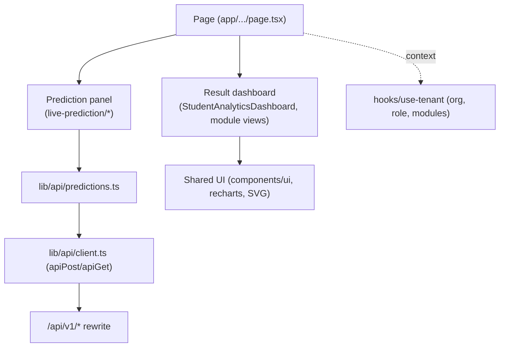

State pattern: each module **page** owns `livePrediction` (and `liveInput` for grade); the panel
lifts results up via `onResult`; the dashboard is a pure function of that state.

---

## Backend Architecture

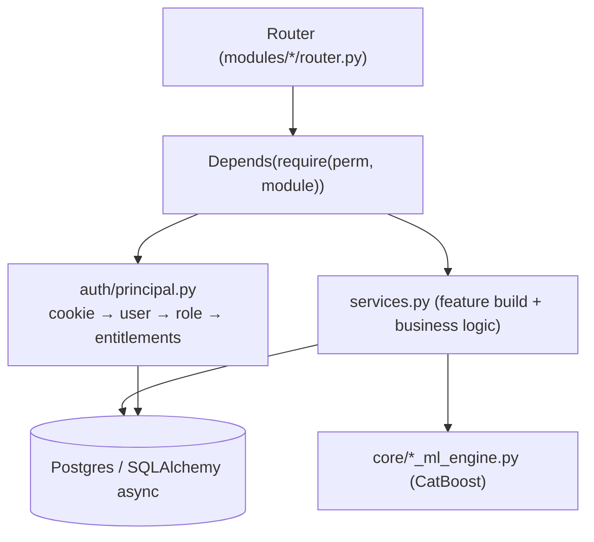

`require()` enforces the permission matrix (`auth/matrix.py`) **and** module entitlement before
the service runs — the real authorization boundary.

---

## Dynamic Data Flow

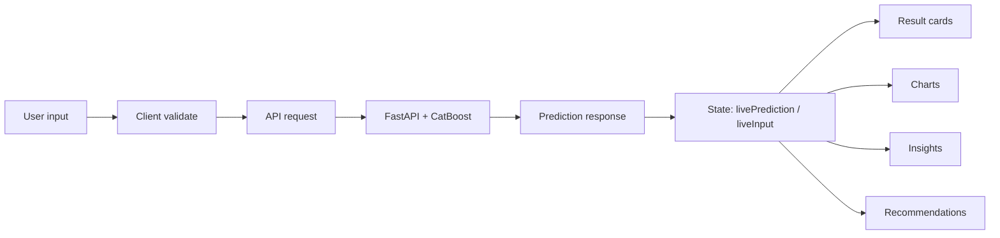

Every card/chart/insight reads from `livePrediction` (+ derived `useMemo`s). Editing any input
clears the result (`onReset`) so **no stale data** remains; the next run repopulates everything.

---

## Charts & Analytics

| Chart | Data Source | Trigger |
|---|---|---|
| Grade trajectory + impact bars | `predicted_sgpa`, `contributing_factors` | Run grade prediction |
| Subject confidence gauge + radar | `confidence_score`, `alternative_options` | Run subject recommendation |
| Career competency radar | submitted skill scores + `alternative_paths` | Run career prediction |
| 9-Box grid + cohort breakdown | `performance/potential levels`, `categoryStats` | Run 9-Box evaluation |
| Batch KPIs / scatter / forecast | `/batch/overview`, `/predict`, `/forecast` | Open Batch / apply filters |

All charts are **recharts** or inline **SVG** bound to React state — they re-render on every new response.

---

## Authentication Flow

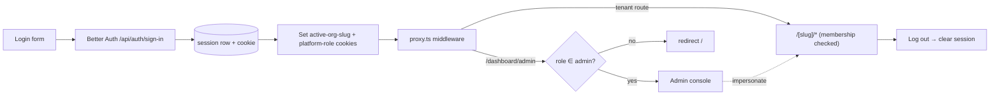

- **Two-plane RBAC:** platform role (`user.role`) + org role (`member.role`); `can()` grants if either allows.
- **Impersonation:** super-admin → `/dashboard/admin/roles` one-click logs in as a seeded demo role; **Return to my account** restores the original session.
- **Backend trust:** FastAPI re-validates the same cookie against the `session` table.

---

## Configuration

| Variable | Purpose |
|---|---|
| `BACKEND_URL` | FastAPI base for the `/api/v1/*` rewrite (`http://localhost:8001`). |
| `DATABASE_URL` | Postgres connection (frontend Drizzle + auth). |
| `BETTER_AUTH_URL` / `BETTER_AUTH_SECRET` | Better Auth base URL + signing secret. |
| `GOOGLE_CLIENT_ID` / `GOOGLE_CLIENT_SECRET` | Google OAuth provider. |
| `ROOT_DOMAIN` | Tenant domain for production redirects. |
| `OLLAMA_BASE_URL` / `OLLAMA_MODEL` | Chatbot LLM endpoint + model (`phi3:mini`). |
| `INTERNAL_API_TOKEN` | Trusted service-to-service bypass (chatbot → ML). |
| `CORS_ALLOW_ORIGINS` | Backend CORS allowlist. |

---

## Error Handling

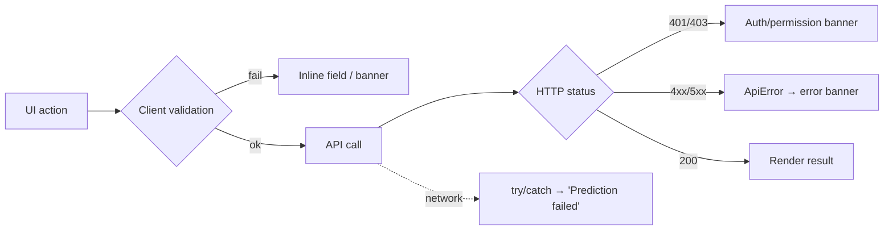

- Frontend: every panel wraps calls in `try/catch`, surfaces `ApiError.message`, and resets result on failure.
- Backend: a global exception handler returns a safe `{error, message}` JSON; auth deps raise `401/403`.

---

## Dependency Map

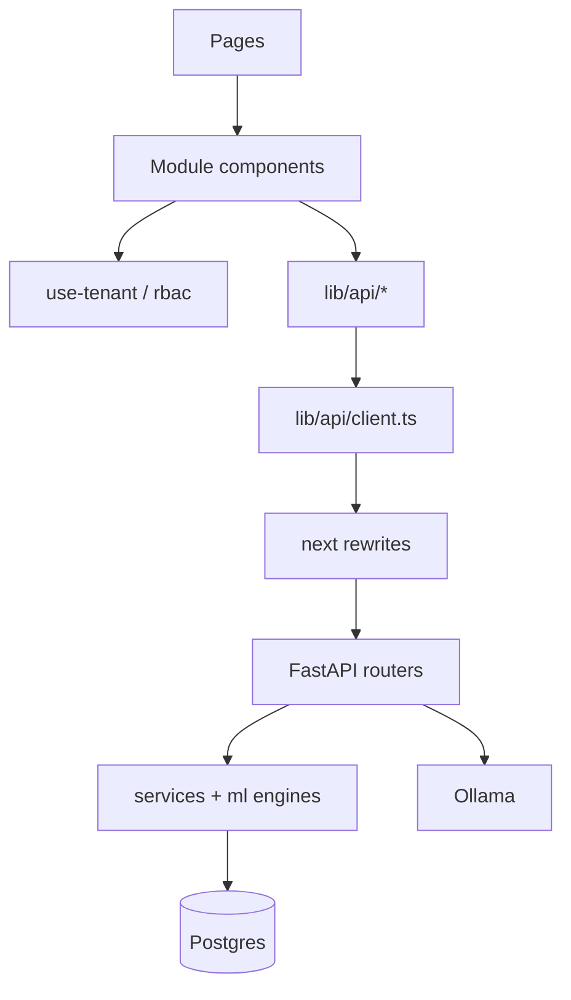

---

## Screenshots & Visuals

Captured under [`docs/screenshots/`](docs/screenshots/) (see its README for the capture steps).

| Screen | Image |
|---|---|
| Tenant dashboard | `docs/screenshots/dashboard.png` |
| Grade Prediction | `docs/screenshots/grade-prediction.png` |
| Subject Prediction | `docs/screenshots/subject-prediction.png` |
| Career Prediction | `docs/screenshots/career-prediction.png` |
| Growth Potential | `docs/screenshots/growth-potential.png` |
| Batch Prediction | `docs/screenshots/batch-prediction.png` |
| Admin · Module grid | `docs/screenshots/admin-modules.png` |
| Admin · Role login | `docs/screenshots/role-based-login.png` |

```markdown

```

---

## Final System Summary

- **Built as** a Next.js 16 frontend + FastAPI backend over one Postgres (pgvector) DB, packaged with Docker Compose; an Ollama sidecar powers the chatbot.
- **Requests flow** Browser → `proxy.ts` (auth + RBAC) → page → `lib/api` → `/api/v1/*` rewrite → FastAPI `require()` gate → service → CatBoost model → JSON.
- **Predictions** are produced by per-module CatBoost models with SHAP explanations; batch endpoints aggregate the 10k-row dataset.
- **Results render** by lifting the response into a single `livePrediction` state per page; cards, charts, insights, and recommendations are pure derivations of that state, so a new run refreshes everything and leaves no stale data.
- **Security** is defense-in-depth: middleware gate → server layout (`requireAdmin`/membership) → server actions → FastAPI cookie validation, all driven by a shared two-plane RBAC matrix mirrored on both sides.

*Generated from the codebase after the full audit, fixes, and verification (build ✓, type-check ✓).*
