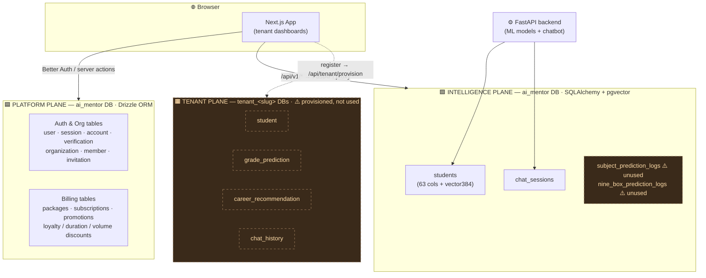
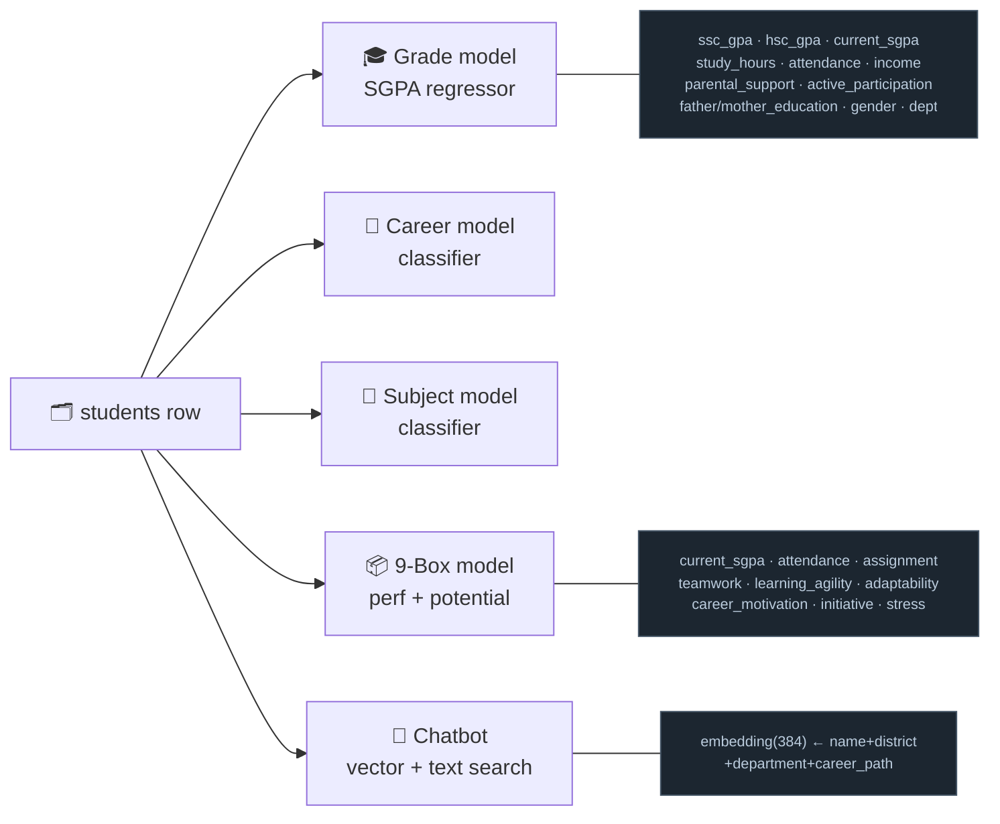
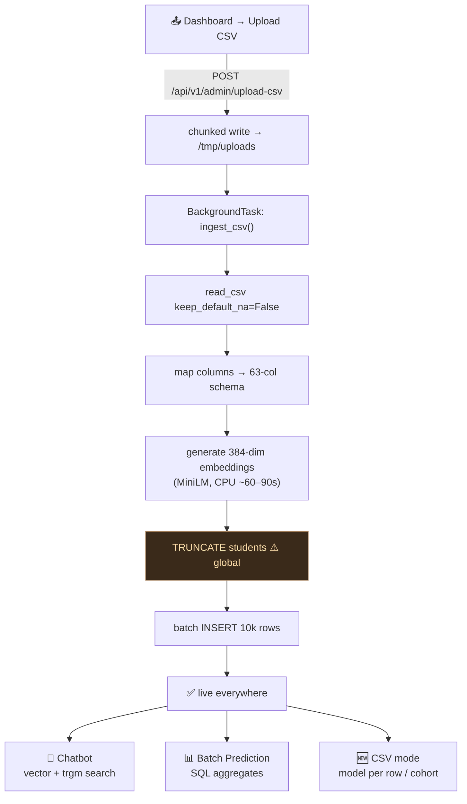
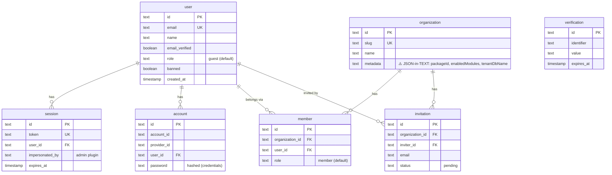
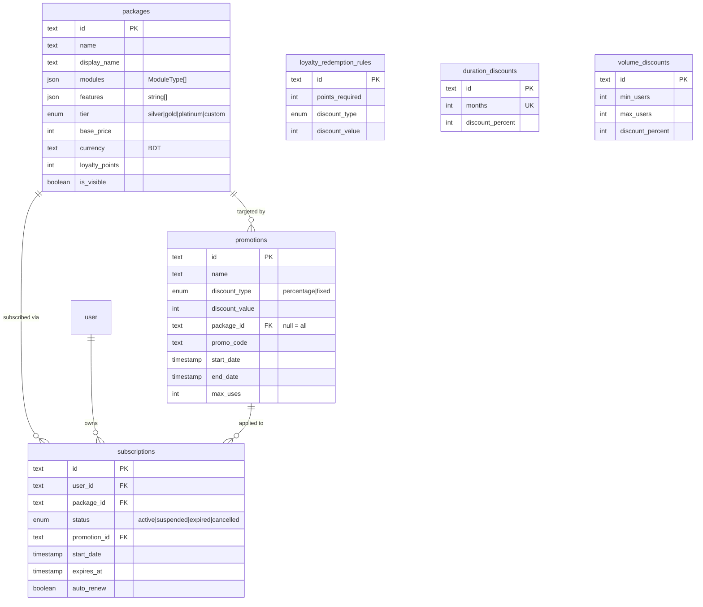
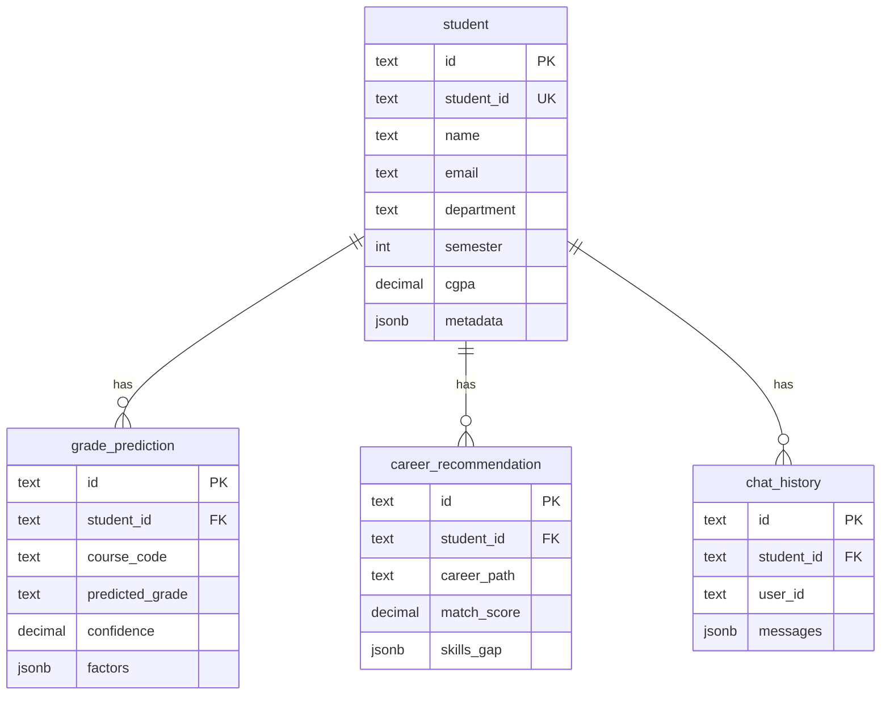
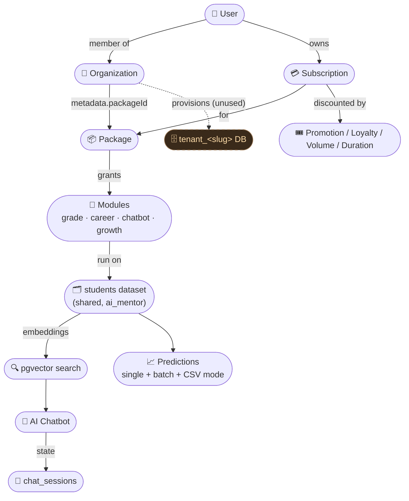
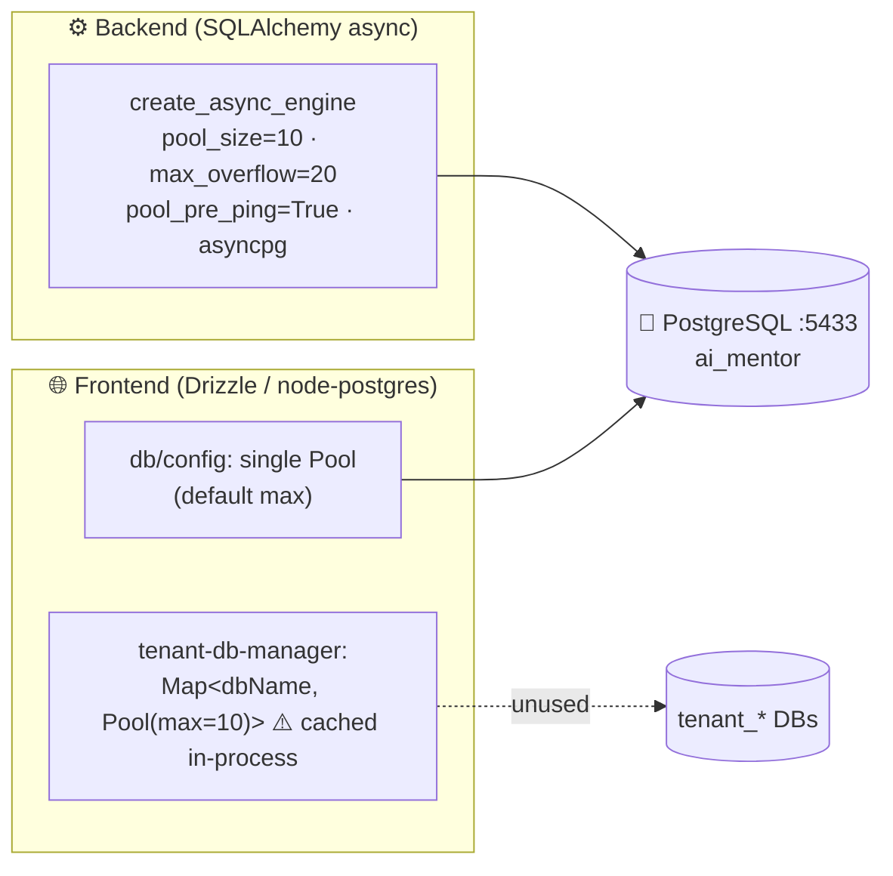
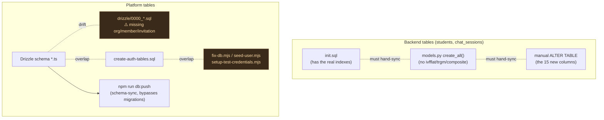

# 🗄️ AI Mentor — Database Reference

> A complete, visual map of every database, table, column, index, relationship, and
> data flow in the AI Mentor platform — plus the known gaps. This is the single
> place to understand how data is stored and moved.
>
> **Scope of truth:** generated from the actual code —
> `backend/init.sql`, `backend/app/chatbot/models.py`, `backend/app/chatbot/database.py`,
> `frontend/db/schema/*.ts`, `frontend/db/tenant-*.ts`, `frontend/drizzle/*`.
> Where the code and reality diverge, it's flagged with ⚠️.

---

## 1. TL;DR

| Thing | Value |
|---|---|
| Engine | **PostgreSQL 15** (`pgvector/pgvector:pg15` image) |
| Extensions | `vector` (pgvector, 384-dim), `pg_trgm` (fuzzy text) |
| Main database | **`ai_mentor`** (port `5433` host → `5432` container) |
| Two ORMs, one DB | **SQLAlchemy** (Python/backend) + **Drizzle** (TS/frontend) both target `ai_mentor` |
| Per-tenant DBs | `tenant_<slug>` — *provisioned but currently unused* ⚠️ |
| Vector model | `sentence-transformers/all-MiniLM-L6-v2` → `vector(384)` |
| Core table | **`students`** — 63 feature columns + embedding; powers chatbot, Batch Prediction, and CSV mode |

---

## 2. The big picture — three data planes



**Read this as:** the browser talks to **two** backends. Login, orgs, and billing go through
Next.js/Drizzle into the `ai_mentor` DB. Everything intelligent (predictions, chatbot, CSV
mode) goes through the FastAPI backend into the **same** `ai_mentor` DB but a different set of
tables. A **third** plane (per-tenant databases) is created at registration but no feature
reads from it yet.

---

## 3. Database & ownership inventory

| Database | Owner / ORM | Tables | Purpose | Status |
|---|---|---|---|---|
| `ai_mentor` | Drizzle (frontend) | `user`, `session`, `account`, `verification`, `organization`, `member`, `invitation` | Auth + multi-org membership (Better Auth) | ✅ used |
| `ai_mentor` | Drizzle (frontend) | `packages`, `subscriptions`, `promotions`, `loyalty_redemption_rules`, `duration_discounts`, `volume_discounts` | Billing / pricing / loyalty | ✅ used |
| `ai_mentor` | SQLAlchemy (backend) | `students` | Cohort dataset + embeddings — the intelligence core | ✅ used |
| `ai_mentor` | SQLAlchemy (backend) | `chat_sessions` | Chatbot conversation state/memory | ✅ used |
| `ai_mentor` | SQLAlchemy (backend) | `subject_prediction_logs`, `nine_box_prediction_logs` | Prediction audit logs | ⚠️ **dead** — never created or written |
| `tenant_<slug>` | Drizzle tenant schema | `student`, `grade_prediction`, `career_recommendation`, `chat_history` | Intended per-tenant isolation | ⚠️ **provisioned, never read/written** |

---

## 4. 🟩 Intelligence plane (backend · pgvector)

### 4.1 ER diagram

```mermaid
erDiagram
    students ||..o{ chat_sessions : "loosely referenced by (no FK)"

    students {
        varchar50  student_id PK "primary key"
        varchar255 name "indexed (btree + trgm)"
        int        age
        varchar20  gender "M / F / Other"
        varchar100 district
        float      current_sgpa "0-4 · indexed w/ dept"
        float      next_semester_sgpa "prediction target"
        varchar100 preferred_department
        float      attendance_rate "0-100"
        float      study_hours_weekly
        vector384  embedding "ivfflat cosine"
        timestamp  created_at
        many       "...58 more feature columns"
    }

    chat_sessions {
        uuid    session_id PK
        varchar selected_student_id "→ students.student_id (no FK)"
        varchar last_resolved_student_id
        jsonb   pending_fields
        varchar last_intent
        varchar last_tool_called
        text    last_tool_summary
        jsonb   context
        timestamp updated_at
    }
```

> ⚠️ `chat_sessions.selected_student_id` points at `students.student_id` **by convention
> only** — there is no foreign key, so orphaned references are possible.

### 4.2 `students` — the 63 columns, grouped

The table is wide on purpose: it's the union of every feature any of the four ML models or
the chatbot needs. Columns are grouped below by what they feed.

| Group | Columns |
|---|---|
| 🔑 **Identity** | `student_id` (PK), `name`, `age`, `gender`, `district` |
| 💰 **Financial** | `family_income`, `budget_per_semester` |
| 📚 **Academic style** | `study_style`, `attendance_rate`, `hsc_gpa` |
| 🧠 **Skills (0–10)** | `english_proficiency`, `math_skill`, `memory_strength`, `stress_management` |
| ✍️ **Study behavior** | `study_hours_weekly`, `assignment_completion_rate`, `class_participation` |
| 🔬 **Project/research** | `project_skill_score`, `research_interest_score`, `extracurricular_involvement` |
| 📈 **Performance** | `current_sgpa`, `past_semester_sgpa_1`, `past_semester_sgpa_2`, `next_semester_sgpa` |
| 👑 **Leadership** | `leadership_indicator`, `productivity_score`, `initiative_score` |
| 🎯 **Interests (0–10)** | `programming_interest`, `business_interest`, `creative_interest`, `hardware_interest`, `math_interest` |
| 🗣️ **Soft skills** | `communication_skill`, `analytical_skill`, `problem_solving_score` |
| ⚙️ **Preferences** | `preferred_department`, `personality_type` |
| 🧮 **Computed scores** | `tech_score`, `business_score`, `creative_score`, `research_score` |
| 💼 **Career** | `work_style`, `soft_skill_score`, `career_orientation`, `preferred_career_path` |
| 📦 **9-Box** | `performance_score`, `potential_score`, `nine_box_position` |
| 🆕 **CSV-mode extras (15)** | `ssc_gpa`, `father_education`, `mother_education`, `part_time_hours`, `parental_support`, `active_participation`, `public_speaking`, `internship_experience_months`, `projects_completed`, `preferred_work_environment`, `interest_area`, `teamwork_score`, `learning_agility`, `adaptability`, `career_motivation` |
| 🔢 **System** | `embedding vector(384)`, `created_at` |

> The 15 "extras" were added so the single-student models (Grade / Career / Growth) can run
> directly off the uploaded dataset in **CSV mode**. They're generated deterministically by
> `backend/scripts/augment_dataset.py`. See `DATASET_SPEC.md`.

### 4.3 Which columns feed which model



Full row→feature mapping lives in `backend/app/modules/csv_mode/mappers.py`.

### 4.4 Index catalog (intelligence plane)

| Index | Table | Type | Columns | Why |
|---|---|---|---|---|
| `students_pkey` | students | btree (PK) | `student_id` | identity lookups |
| `idx_students_name` | students | btree | `name` | exact name match |
| `idx_students_name_gin` | students | **GIN (trgm)** | `name` | fuzzy "find student named …" |
| `idx_students_id` | students | btree | `student_id` | explicit id index |
| `idx_students_embedding` | students | **ivfflat** (`vector_cosine_ops`, `lists=100`) | `embedding` | semantic search ⚠️ built on empty table |
| `idx_students_dept_sgpa` | students | btree (composite) | `preferred_department`, `current_sgpa` | dept dashboards + filters |
| `idx_chat_sessions_id` | chat_sessions | btree | `session_id` | session fetch |
| `idx_chat_sessions_student` | chat_sessions | btree | `selected_student_id` | resume by student |
| `idx_chat_sessions_updated` | chat_sessions | btree | `updated_at` | recency / cleanup |

### 4.5 Ingestion & prediction lifecycle



> ⚠️ **`TRUNCATE` is global** — there's no `tenant_id`, so re-uploading replaces *all* data.
> ⚠️ The `ivfflat` index is **never re-built** after TRUNCATE+reinsert, so centroids drift.

---

## 5. 🟦 Platform plane (frontend · Drizzle)

### 5.1 Auth & organization ER diagram



> ⚠️ `organization.metadata` is a **`text` column holding JSON** (`packageId`,
> `enabledModules`, and after provisioning, `tenantDbName`). It's parsed by hand in
> `/api/tenant/provision`. `jsonb` would make it queryable and validatable.

### 5.2 Billing / pricing ER diagram



### 5.3 Enums

| Enum | Values |
|---|---|
| `package_tier` | `silver`, `gold`, `platinum`, `custom` |
| `subscription_status` | `active`, `suspended`, `expired`, `cancelled` |
| `discount_type` | `percentage`, `fixed` |
| `ModuleType` *(TS-only, stored in `packages.modules` json)* | `grade-prediction`, `career-guidance`, `ai-chatbot`, `growth-potential` |

### 5.4 Index catalog (platform plane)

| Table | Indexes |
|---|---|
| `user` | PK `id`, UK `email` |
| `session` | PK `id`, UK `token`, `session_userId_idx` |
| `account` | PK `id`, `account_userId_idx` |
| `verification` | PK `id`, `verification_identifier_idx` |
| `organization` | PK `id`, UK `slug`, `organization_slug_idx` |
| `member` | PK `id`, `member_organizationId_idx`, `member_userId_idx` |
| `invitation` | PK `id`, `invitation_organizationId_idx`, `invitation_email_idx` |
| `packages` | PK `id`, `packages_tier_idx`, `packages_visible_idx` |
| `subscriptions` | PK `id`, `subscriptions_user_idx`, `subscriptions_package_idx`, `subscriptions_status_idx` |
| `promotions` | PK `id`, `promotions_package_idx`, `promotions_active_idx`, `promotions_dates_idx` |
| `duration_discounts` | PK `id`, UK `months`, `duration_discounts_months_idx` |
| `volume_discounts` | PK `id`, `volume_discounts_range_idx` |
| `loyalty_redemption_rules` | PK `id`, `loyalty_rules_active_idx` |

---

## 6. 🟧 Tenant plane (provisioned, unused)

At registration, `register-form.tsx` → `POST /api/tenant/provision` →
`createTenantDatabase(slug)` creates a **separate database** `tenant_<slug>` with these tables.



> ⚠️ **This whole plane is currently dead weight.** All predictions and chat run against the
> backend's shared `students` table in `ai_mentor` — *nothing reads or writes the
> `tenant_<slug>` tables*. Note the schema also **diverges** from the backend `students`
> (here: `id/student_id/name/email/department/semester/cgpa`; there: 63 ML columns).

---

## 7. 🕸️ Concept knowledge graph

How the entities relate across all three planes, conceptually:



**Narrative:** a *user* joins an *organization*; the org's *package* (recorded in
`organization.metadata`) unlocks a set of *modules*; a *subscription* (optionally discounted)
records the commercial relationship. The modules all operate on **one shared `students`
dataset** — embeddings power the chatbot, and the ML models power predictions, with chatbot
memory living in `chat_sessions`. The per-tenant database the org provisions is not yet wired
into any of this.

---

## 8. Connections, pooling & sessions



| Aspect | Backend | Frontend platform | Frontend tenant |
|---|---|---|---|
| Driver | `asyncpg` | `pg` (node-postgres) | `pg` |
| Pooling | 10 + 20 overflow, pre-ping | default pool | `Map` of pools, max 10 each |
| Session | `async_sessionmaker`, `expire_on_commit=False` | Drizzle | Drizzle |
| ⚠️ Risk | — | — | pool `Map` leaks under serverless |

---

## 9. ⚠️ Schema management — sources of truth (fragmented)

The same tables are defined in **multiple overlapping places**, which is the biggest
maintainability risk in the system today.



| Table set | Authoritative file(s) | Drift notes |
|---|---|---|
| `students`, `chat_sessions` | `init.sql` **and** `models.py` | indexes only in `init.sql`; columns added by manual `ALTER` |
| `user/session/account/verification` | Drizzle schema + `0000` migration + `create-auth-tables.sql` | triple-defined |
| `organization/member/invitation` | Drizzle schema + `create-auth-tables.sql` | ⚠️ **absent from `0000` migration** |
| billing tables | Drizzle schema + `0000` migration | consistent |
| `session.impersonated_by` | in `0000` **and** patched by `fix-db.mjs` | redundant |

---

## 10. 🚦 Known gaps & optimization backlog

Severity-ranked. (Full reasoning was captured during the DB audit.)

| # | Severity | Gap | Where |
|---|---|---|---|
| 1 | 🔴 Critical | **No tenant isolation** in backend `students` (no `tenant_id`); CSV upload `TRUNCATE`s globally | `init.sql`, `ingest_csv.py` |
| 2 | 🔴 Critical | **Per-tenant DB plane is provisioned but unused**; diverges from backend `students` | `tenant-db-manager.ts` |
| 3 | 🟠 High | **Fragmented schema sources** (push vs migrate; `0000` missing org tables; manual fixes) | §9 |
| 4 | 🟠 High | **Dual source of truth** `init.sql` ↔ `models.py` (indexes only in SQL) | backend |
| 5 | 🟡 Medium | **Orphan tables** `subject_prediction_logs`, `nine_box_prediction_logs` (own `Base`, never created/written) → no prediction audit trail | module `models.py` |
| 6 | 🟡 Medium | **`ivfflat` built on empty table**, never re-indexed after re-ingest → degraded recall; consider **HNSW** + `ANALYZE` | `init.sql` |
| 7 | 🟢 Low | `organization.metadata` is JSON-in-`text`, not `jsonb` | `auth-schema.ts` |
| 8 | 🟢 Low | Tenant pool `Map` leaks under serverless | `tenant-db-manager.ts` |
| 9 | 🟢 Low | No FK `chat_sessions.selected_student_id → students`; no statement timeout | backend |

### Suggested remediation order
1. **Decide tenancy** — either add `organization_id` to `students` + scope queries (stop global TRUNCATE), **or** formally retire the `tenant_<slug>` plane and document "single shared dataset."
2. **Pick one schema workflow** — `db:push` *or* migrations; regenerate one authoritative migration; fold `create-auth-tables.sql` + `fix-db.mjs` into it. Make `init.sql` the single backend source.
3. **Remove orphan log models** (or wire them for auditing).
4. **Switch vector index to HNSW** and `ANALYZE` after each ingest.

---

## 11. ✅ What's already good

- The **Drizzle auth + billing schema** is clean: proper `pgEnum`s, FK cascade rules, typed
  `$inferSelect/$inferInsert`, sensible per-table indexes.
- The **`students` text-search indexes** (GIN/trgm + composite dept/sgpa) are well-suited to
  the chatbot's fuzzy lookups and dashboard filters.
- **Backend pool config** (`pool_size=10, max_overflow=20, pool_pre_ping=True`) is reasonable.
- **pgvector + MiniLM** is an appropriate, lightweight choice for 10k-row semantic search.

---

## 12. Appendix — file map

| Concern | File |
|---|---|
| Backend table DDL + indexes | `backend/init.sql` |
| Backend ORM models | `backend/app/chatbot/models.py` |
| Backend engine/session/`init_db` | `backend/app/chatbot/database.py` |
| Startup DB/pgvector checks | `backend/app/chatbot/startup.py` |
| CSV ingestion pipeline | `backend/app/chatbot/ingest_csv.py` |
| Dataset augmentation (15 cols) | `backend/scripts/augment_dataset.py` |
| Orphan log models | `backend/app/modules/{subject,nine_box}_predictor/models.py` |
| CSV→model mappers | `backend/app/modules/csv_mode/mappers.py` |
| Drizzle auth/org schema | `frontend/db/schema/auth-schema.ts` |
| Drizzle billing schema | `frontend/db/schema/package-schema.ts` |
| Drizzle migration | `frontend/drizzle/0000_shallow_mathemanic.sql` |
| Tenant schema (Drizzle) | `frontend/db/tenant-schema.ts` |
| Tenant DB manager | `frontend/db/tenant-db-manager.ts` |
| Main DB client | `frontend/db/config/index.ts` |
| Raw auth DDL | `frontend/create-auth-tables.sql` |
| Manual patch scripts | `frontend/fix-db.mjs`, `frontend/seed-user.mjs`, `setup-test-credentials.mjs` |
| Dataset contract | `DATASET_SPEC.md` |

---

*Generated from source. When you change a schema, update the relevant section here and (ideally) collapse the fragmented DDL sources noted in §9 so this file can stay the map, not the territory.*
