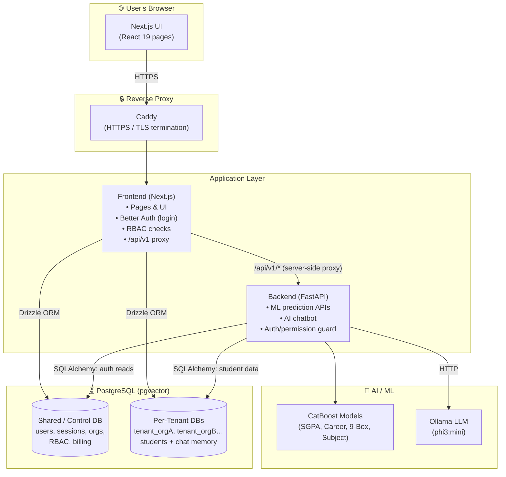
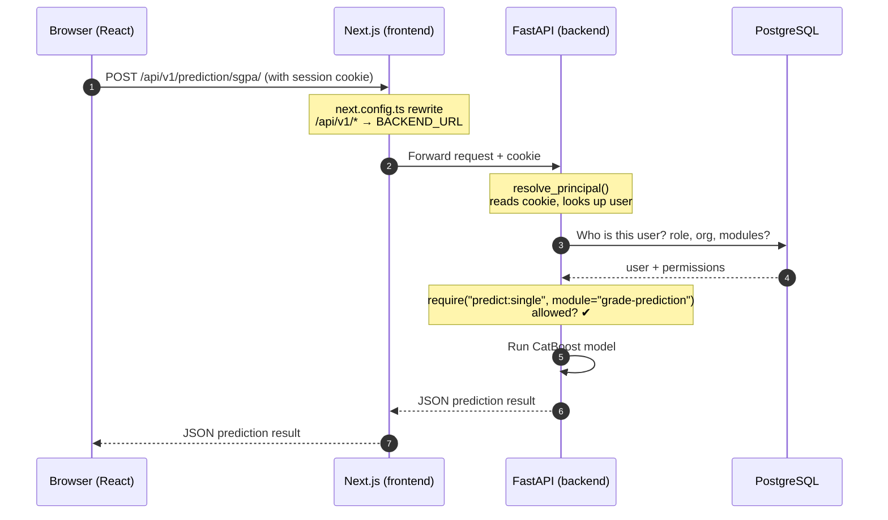
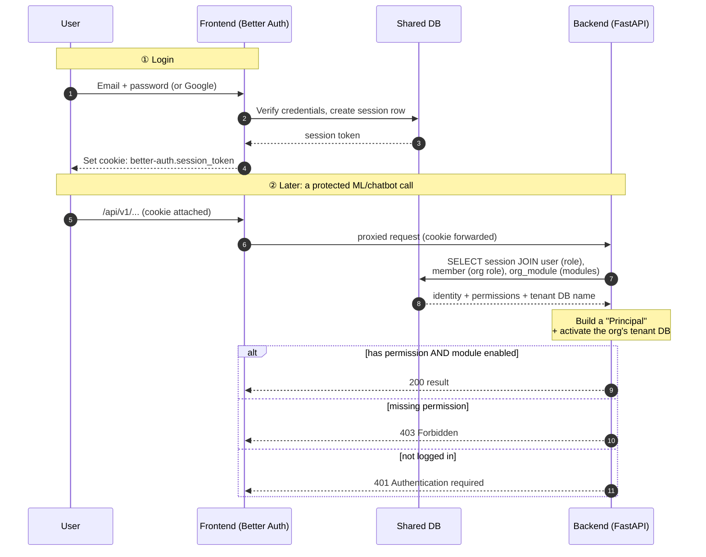
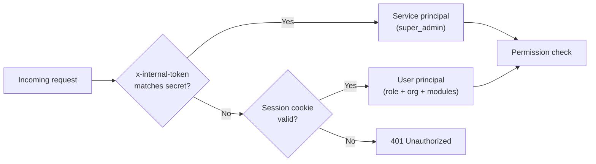
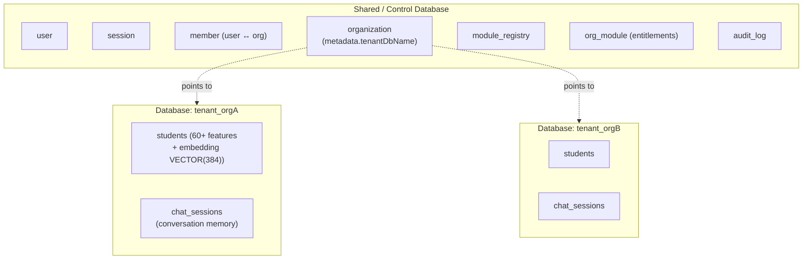
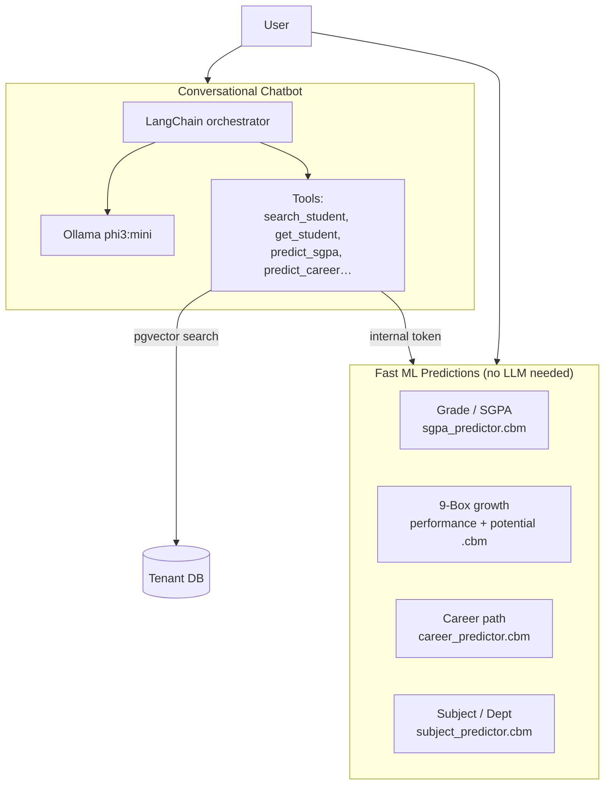
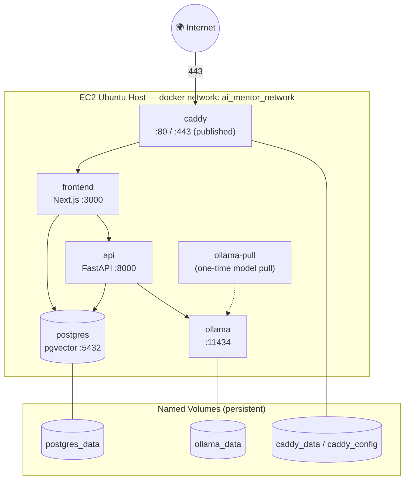
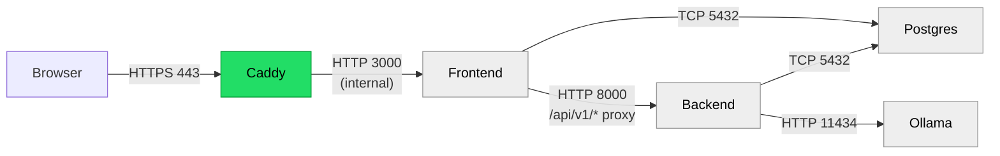
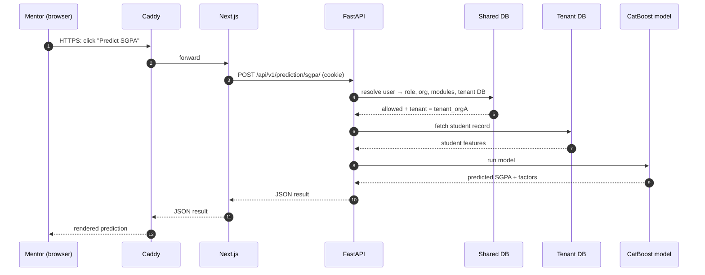

# AI Mentor — System Architecture

> A plain-language guide to how the whole system fits together, with diagrams. Read this top-to-bottom to understand what each piece does and how the pieces talk to each other.
>
> **Companion doc:** [deployment-audit.md](deployment-audit.md) covers deployment, risks, and remediations.

---

## 1. The Big Picture (in one paragraph)

AI Mentor is a **multi-tenant SaaS** that helps mentors understand students using machine learning. There are two applications: a **frontend** (Next.js — the website users see) and a **backend** (FastAPI — the Python brain that runs the ML models and the chatbot). They share one **PostgreSQL** database server. A **local AI model server (Ollama)** powers the chatbot. Every organization ("tenant") that signs up gets its **own separate database** for its student data, while login/accounts live in one **shared database**. The browser only ever talks to the frontend; the frontend quietly forwards AI/ML requests to the backend behind the scenes.

---

## 2. Overall Architecture



**What each box does:**
- **Browser** — runs the React UI. It only knows about the frontend.
- **Caddy** — the front door. It handles HTTPS so cookies are secure, then passes traffic to the frontend.
- **Frontend (Next.js)** — serves the website, handles login (Better Auth), checks permissions, and **proxies** any `/api/v1/...` call to the backend.
- **Backend (FastAPI)** — the ML engine + chatbot. Every request is checked against the user's permissions.
- **CatBoost models** — pre-trained files (`.cbm`) that make predictions instantly (no external AI needed).
- **Ollama** — a local Large Language Model that powers the conversational chatbot.
- **PostgreSQL** — one server, two roles: a **shared DB** for accounts/permissions, and **one database per organization** for that org's private student data.

---

## 3. Frontend ↔ Backend Communication

The browser **never** calls the backend directly. Instead, the frontend rewrites any request to `/api/v1/*` and forwards it server-side to FastAPI. This keeps everything "same-origin," so the login cookie travels along automatically.



**Why this design?**
- **Security:** the backend is never exposed to the public internet — only the frontend can reach it.
- **Cookies work:** because the browser thinks it's all one website, the `SameSite=Lax` session cookie is sent without cross-site issues. (`skipTrailingSlashRedirect` in `next.config.ts` exists specifically to stop redirects from dropping that cookie.)
- **`BACKEND_URL`** is set when the frontend is **built**, and tells the proxy where the backend lives (e.g. `http://api:8000`).

**Key files:** `frontend/next.config.ts` (the rewrite), `frontend/lib/api/*` (the client helpers), `backend/app/main.py` (routes).

---

## 4. Authentication & Authorization Flow

Login is handled by **Better Auth** in the frontend. The clever part: the **backend trusts the same session table** the frontend writes to, so there's a single source of truth for "who is logged in."



### How permissions are decided
There are **two role planes**, and a permission is granted if **either** grants it:

| Plane | Column | Example roles |
|-------|--------|---------------|
| Platform role | `user.role` | `super_admin`, `support`, `user`, `guest` |
| Org role | `member.role` | `owner`, `admin`, `analyst`, `mentor`, `viewer`, `guest` |

- `super_admin` can do everything.
- A **module** (like `ai-chatbot` or `batch-prediction`) must also be **enabled for that organization** — checked separately.
- The rules live in **two mirrored files** kept in sync: `backend/app/auth/matrix.py` and `frontend/lib/rbac.ts`. A test (`backend/tests/test_rbac_sync.py`) fails if they ever drift apart.

### One special case: internal service calls
When the **chatbot** needs to run a prediction, it calls the ML endpoints itself using a secret header (`x-internal-token`). The backend recognizes this token and treats the call as a trusted "super-admin service" — so the chatbot can work on the user's behalf without re-doing login.



**Key files:** `frontend/lib/auth.ts`, `backend/app/auth/principal.py`, `backend/app/auth/deps.py`, `backend/app/auth/internal_token.py`.

---

## 5. Database Interactions (Multi-Tenancy)

The system uses **one shared database for accounts** and **one separate database per organization** for that org's private data. This keeps each customer's student data fully isolated.



### How a request lands on the right tenant database

```mermaid
sequenceDiagram
    autonumber
    participant BE as Backend
    participant Ctl as Shared DB
    participant T as Tenant DB

    BE->>Ctl: Look up user's org → organization.metadata.tenantDbName
    Ctl-->>BE: e.g. "tenant_orgA"
    Note over BE: current_tenant_db.set("tenant_orgA")<br/>(isolated per request via contextvars)
    BE->>T: ensure_tenant_ready() — create pgvector + tables if first time
    BE->>T: All student queries run here
    Note over BE: Auth reads ALWAYS use the shared DB;<br/>student data ALWAYS uses the tenant DB
```

**In simple terms:**
- **Accounts and permissions** always live in the **shared** database.
- When you make a request, the backend figures out your organization, then **switches** all your student-data queries to your org's **private** database — automatically and safely, even when many people use the system at once (`contextvars` isolates each request).
- New tenant databases are created by the frontend when an org is provisioned (`frontend/db/tenant-db-manager.ts` → `createTenantDatabase`), and the backend builds the tables on first use.
- Both apps use **connection pools** (a reusable set of DB connections) — one pool per tenant. Pool sizes are configurable via environment variables.

**Key files:** `backend/app/chatbot/database.py`, `frontend/db/tenant-db-manager.ts`, `frontend/db/schema/*`, `backend/init.sql`.

---

## 6. AI / ML Subsystem

Two very different kinds of "AI" live here:



- **CatBoost models** are pre-trained files committed in the repo. They load once at startup and return predictions in milliseconds — no internet or paid API required.
- **The chatbot** uses **Ollama (phi3:mini)**, a local language model. It reads your message, decides which tool to call (e.g. "predict this student's SGPA"), calls the prediction endpoints internally, remembers the conversation, and replies naturally.
- **Semantic search:** student records store a 384-number "embedding" (via `sentence-transformers`), so the chatbot can find students by meaning, not just exact name (using pgvector + fuzzy text search).

**Key files:** `backend/app/core/*` (engines), `backend/app/modules/*` (prediction APIs), `backend/app/chatbot/*` (orchestrator, tools, LLM client).

---

## 7. Docker Architecture

In production, everything runs as Docker containers orchestrated by `docker-compose.prod.yml`. Only Caddy is exposed to the internet.



**What's happening:**
- Each service is a container on a **private Docker network**. They find each other by name (`api`, `postgres`, `ollama`).
- **Only Caddy publishes ports** (80/443). Postgres, Ollama, the API, and the frontend are **not reachable from the internet** — a big security win.
- **Named volumes** keep data safe across restarts: the database, the downloaded LLM, and Caddy's TLS certificates all persist.
- `ollama-pull` is a run-once helper that downloads the `phi3:mini` model, then exits.
- Restart policies (`unless-stopped`) auto-recover services if they crash or the box reboots.

> A separate `backend/docker-compose.yml` is the **development** stack (with live-reload and source mounting) — not for production.

**Key files:** `docker-compose.prod.yml`, `deploy/Caddyfile`, `frontend/Dockerfile`, `backend/Dockerfile`, `.env`.

---

## 8. Network Communication & Ports



| Port | Service | Exposed publicly? | Purpose |
|------|---------|-------------------|---------|
| 443 / 80 | Caddy | ✅ Yes | HTTPS entry (80 redirects to 443) |
| 3000 | Frontend | ❌ Internal | Next.js server |
| 8000 | Backend | ❌ Internal | FastAPI (ML + chatbot) |
| 5432 | PostgreSQL | ❌ Internal | Database |
| 11434 | Ollama | ❌ Internal | Local LLM |

**Rule of thumb:** traffic enters only through Caddy on 443. Everything else talks over the private Docker network and is invisible to the outside world. On AWS, the security group should only open **22 (SSH), 80, and 443**.

---

## 9. End-to-End Example: "Predict this student's grade"

Putting it all together — what happens when a mentor clicks *Predict SGPA*:



1. The click becomes an HTTPS request to **Caddy**.
2. Caddy hands it to the **frontend**, which forwards `/api/v1/...` to the **backend** (cookie attached).
3. The backend checks **who you are** (shared DB) and **whether you're allowed**.
4. It switches to your org's **tenant database**, fetches the student, and runs the **CatBoost model**.
5. The result travels back the same way to your screen.

---

## 10. Component Cheat-Sheet

| Component | Tech | Plain-language role | Where |
|-----------|------|---------------------|-------|
| UI | Next.js 16 / React 19 | The website you click around in | `frontend/app`, `frontend/components` |
| Auth | Better Auth | Login, sessions, Google sign-in | `frontend/lib/auth.ts` |
| RBAC | Custom matrix | Who can do what | `frontend/lib/rbac.ts`, `backend/app/auth/matrix.py` |
| API proxy | Next.js rewrites | Forwards `/api/v1/*` to backend | `frontend/next.config.ts` |
| ML API | FastAPI | Runs the prediction models | `backend/app/modules/*` |
| ML engines | CatBoost | The actual trained models | `backend/app/core/*`, `*.cbm` files |
| Chatbot | LangChain + Ollama | Conversational assistant | `backend/app/chatbot/*` |
| Auth guard | FastAPI deps | Blocks unauthorized calls | `backend/app/auth/deps.py` |
| Tenancy | contextvars + pools | Routes each org to its own DB | `backend/app/chatbot/database.py` |
| Database | PostgreSQL + pgvector | Stores everything | `frontend/db`, `backend/init.sql` |
| Proxy/TLS | Caddy | HTTPS front door | `deploy/Caddyfile` |
| Orchestration | Docker Compose | Runs all services together | `docker-compose.prod.yml` |

---

*This document describes the system as it exists in the repository. For deployment steps and production hardening, see [deployment-audit.md](deployment-audit.md).*
