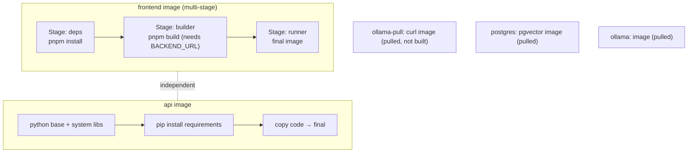
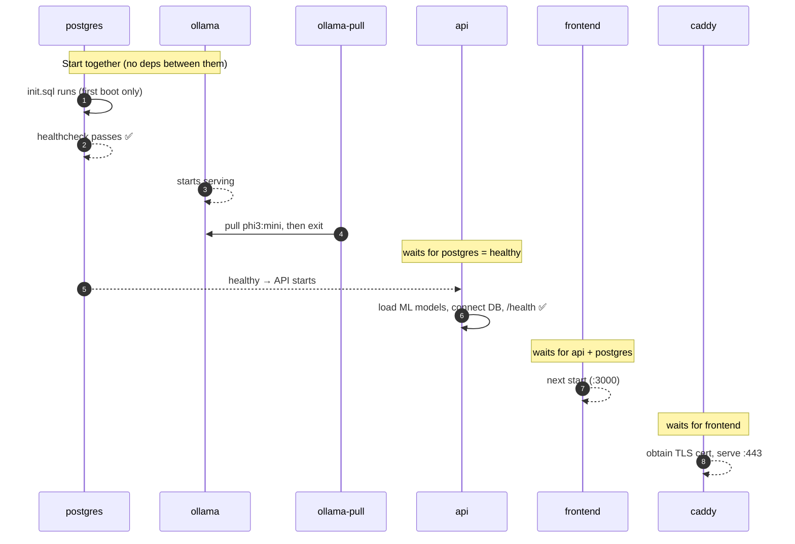
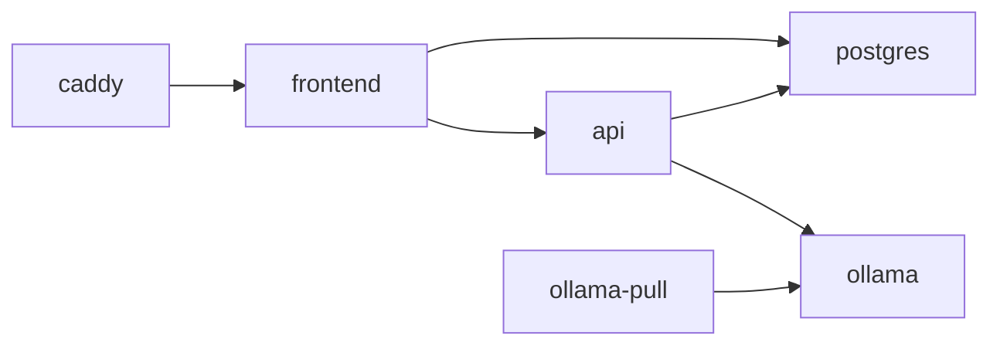
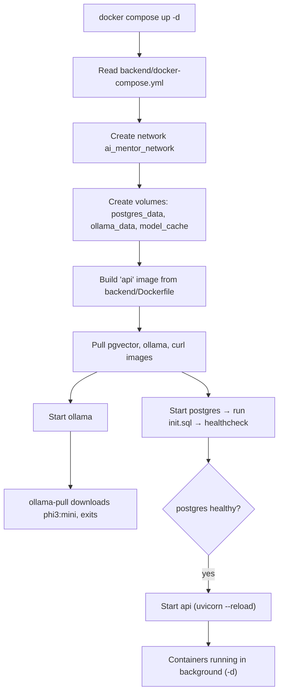

# Docker, Explained — Every Dockerfile & Compose File in This Repo

> A line-by-line, plain-language walkthrough of how this project is containerized: what every service does, the order things build and start, networks, volumes, ports, dependencies, env vars, health checks, and what actually happens when you run `docker compose up -d`.
>
> **Companion docs:** [architecture.md](architecture.md) · [deployment-audit.md](deployment-audit.md)

---

## 0. Inventory — the Docker files in this repo

| File | Purpose |
|------|---------|
| `backend/Dockerfile` | Builds the **FastAPI** (Python) image |
| `frontend/Dockerfile` | Builds the **Next.js** (Node) image — multi-stage |
| `frontend/.dockerignore` | Keeps junk out of the frontend build context |
| `backend/docker-compose.yml` | **DEV** stack (Postgres + Ollama + API, with live-reload) |
| `docker-compose.prod.yml` | **PROD** stack (adds frontend + Caddy TLS, hardened) |

> There are **two** compose files. `backend/docker-compose.yml` is for local development. `docker-compose.prod.yml` (repo root) is the real deployment. They behave differently — this doc covers both and calls out the differences.

---

## 1. `backend/Dockerfile` — the FastAPI image

```dockerfile
FROM python:3.11-slim as base
ENV PYTHONDONTWRITEBYTECODE=1 PYTHONUNBUFFERED=1 PIP_NO_CACHE_DIR=1 PIP_DISABLE_PIP_VERSION_CHECK=1
RUN apt-get update && apt-get install -y --no-install-recommends build-essential curl libpq-dev && rm -rf /var/lib/apt/lists/*
RUN useradd --create-home --shell /bin/bash appuser
WORKDIR /app
COPY requirements.txt .
RUN pip install --no-cache-dir -r requirements.txt
COPY --chown=appuser:appuser . .
USER appuser
EXPOSE 8000
HEALTHCHECK --interval=30s --timeout=10s --start-period=5s --retries=3 CMD curl -f http://localhost:8000/health || exit 1
CMD ["uvicorn", "app.main:app", "--host", "0.0.0.0", "--port", "8000"]
```

**What each part does, in order:**
1. **`FROM python:3.11-slim`** — start from a small official Python 3.11 image.
2. **`ENV ...`** — tuning:
   - `PYTHONDONTWRITEBYTECODE` — don't litter `.pyc` files.
   - `PYTHONUNBUFFERED` — print logs immediately (so `docker logs` shows them live).
   - `PIP_NO_CACHE_DIR` / `PIP_DISABLE_PIP_VERSION_CHECK` — smaller image, quieter build.
3. **`apt-get install build-essential curl libpq-dev`** — system libraries needed to compile Python packages (CatBoost, torch, asyncpg) and for the health check (`curl`) and Postgres client libs (`libpq-dev`).
4. **`useradd appuser`** — creates a non-root user (security best practice).
5. **`COPY requirements.txt` then `pip install`** — **done before** copying the code so Docker can **cache** the (slow) dependency install. If only your code changes, this layer is reused.
6. **`COPY . .`** — copy the backend source, owned by `appuser`.
7. **`USER appuser`** — switch off root for everything that runs.
8. **`EXPOSE 8000`** — documents that the app listens on 8000 (informational).
9. **`HEALTHCHECK`** — every 30s, curl `/health`; if it fails 3× the container is marked *unhealthy*.
10. **`CMD uvicorn ...`** — the default start command (no `--reload` — production-shaped).

> **Note:** the dev compose *overrides* this `CMD` to add `--reload`. The prod compose uses a command equivalent to this one.

---

## 2. `frontend/Dockerfile` — the Next.js image (multi-stage)

This uses **three stages** so the final image is small and doesn't ship build tools.

```dockerfile
# ── Stage 1: deps ──
FROM node:20-alpine AS deps
WORKDIR /app
RUN corepack enable && corepack prepare pnpm@latest --activate
COPY package.json pnpm-lock.yaml* ./
RUN pnpm install --frozen-lockfile --offline || pnpm install

# ── Stage 2: builder ──
FROM node:20-alpine AS builder
WORKDIR /app
COPY --from=deps /app/node_modules ./node_modules
COPY . .
ARG BACKEND_URL
ENV BACKEND_URL=${BACKEND_URL}
RUN if [ -z "$BACKEND_URL" ]; then echo "ERROR: BACKEND_URL build arg is required..."; exit 1; fi \
    && echo "Using BACKEND_URL=${BACKEND_URL}" && pnpm build

# ── Stage 3: runner ──
FROM node:20-alpine AS runner
WORKDIR /app
ENV NODE_ENV=production
RUN corepack enable && corepack prepare pnpm@latest --activate
COPY --from=builder /app .
EXPOSE 3000
CMD ["pnpm","start","--","-p","3000"]
```

**Stage 1 — `deps` (install dependencies):**
- `node:20-alpine` — tiny Node 20 base.
- `corepack ... pnpm` — enables **pnpm**, the package manager this project uses.
- Copies only `package.json` + lockfile, then installs. Copying just these first means the (slow) install is **cached** unless dependencies change.
- `--frozen-lockfile --offline || pnpm install` — try a reproducible offline install; fall back to a normal install if needed.

**Stage 2 — `builder` (compile the app):**
- Reuses `node_modules` from stage 1.
- Copies the full source.
- **`ARG BACKEND_URL` / `ENV BACKEND_URL`** — this is the critical one. `BACKEND_URL` is **baked into the app at build time** because Next.js rewrites (`/api/v1/*` → backend) are fixed when you build.
- The `if [ -z "$BACKEND_URL" ]` guard **fails the build** if you forgot to pass it — so an image never silently ships pointing at `localhost`.
- `pnpm build` — produces the optimized production build.

**Stage 3 — `runner` (the final, shipped image):**
- Fresh small base — **no build tools, no source-only clutter**.
- `NODE_ENV=production` — turns on production behavior (and secure cookies in Better Auth).
- Copies the built app from the builder stage.
- `EXPOSE 3000`, then `pnpm start` runs the production server on port 3000.

**Why multi-stage?** The heavy stuff (dev dependencies, build cache) stays in earlier stages and is thrown away. Only the finished app ships → smaller, safer image.

**`.dockerignore`** ensures `node_modules/`, `.next/`, `.env.local`, `.git/`, editor files, and logs are **never** copied into the build — faster builds and no secret leakage.

---

## 3. `backend/docker-compose.yml` — the DEV stack

Four services: `postgres`, `ollama`, `api`, and a one-shot `ollama-pull`.

### Services

**`postgres`** — the database.
- Image `pgvector/pgvector:pg15` (Postgres 15 **with the vector extension** for AI search).
- Env: `POSTGRES_USER/PASSWORD/DB` = `postgres/postgres/ai_mentor` (**dev-only defaults**).
- Volumes: `postgres_data` (persistent data) + mounts `init.sql` to auto-run on first boot (creates tables, pgvector, indexes).
- Port: **`5433:5432`** — Postgres is reachable on your laptop at `localhost:5433`.
- Health check: `pg_isready` every 10s.

**`ollama`** — the local LLM server for the chatbot.
- Image `ollama/ollama:latest`.
- Volume `ollama_data` stores downloaded models so you don't re-download.
- Port **`11434:11434`**.
- Reserves 4 GB memory; limits parallelism to keep memory sane.
- Health check: curl `/api/tags`.

**`api`** — the FastAPI backend.
- **Builds** from `backend/Dockerfile`.
- Env: `DATABASE_URL` (points at the `postgres` service), `OLLAMA_BASE_URL`, `OLLAMA_MODEL=phi3:mini`.
- Port **`8001:8000`** — backend reachable at `localhost:8001`.
- **`depends_on: postgres (healthy)`** — waits for the DB to be ready.
- Volumes: **bind-mounts `./app` into the container (read-only)** and a `model_cache` volume.
- **Command override:** `uvicorn ... --reload` → **live code reload** for development.

**`ollama-pull`** — a run-once helper.
- A tiny curl container that waits, then tells Ollama to download `phi3:mini`, then **exits** (`restart: "no"`).

### Networks
- One bridge network `ai_mentor_network`. All four services join it and can reach each other **by name** (`postgres`, `ollama`, `api`).

### Volumes
| Volume | Holds |
|--------|-------|
| `postgres_data` | Database files (survives restarts) |
| `ollama_data` | Downloaded LLM models |
| `model_cache` | ML model cache for the API |

### ⚠️ This file is DEV-only
- `--reload` and the `./app` bind mount are for fast local iteration — **not** for production.
- Credentials are the well-known `postgres/postgres`.
- It does **not** include the frontend or TLS. Use `docker-compose.prod.yml` for deployment.

---

## 4. `docker-compose.prod.yml` — the PRODUCTION stack

Six services: `postgres`, `ollama`, `ollama-pull`, `api`, `frontend`, `caddy`. Hardened and complete.

### Services & what changed vs dev

| Service | Role | Key production choices |
|---------|------|------------------------|
| `caddy` | HTTPS front door | **Only service with published ports (80/443).** Auto TLS via Let's Encrypt. |
| `frontend` | Next.js UI | Built with `BACKEND_URL=http://api:8000` baked in; `NODE_ENV=production`. |
| `api` | FastAPI ML/chatbot | Plain `uvicorn` (**no `--reload`**), **no source mount**, `mem_limit`. |
| `postgres` | Database | **Credentials required from `.env`** (no defaults). No host port published. |
| `ollama` | Local LLM | `mem_limit` ceiling to protect the host. No host port published. |
| `ollama-pull` | Model downloader | Runs once, pulls the model, exits. |

### Networks
- Single bridge network `ai_mentor_network`. Internal services talk by name and are **invisible to the internet** — only Caddy is exposed.

### Volumes
| Volume | Holds |
|--------|-------|
| `postgres_data` | Database |
| `ollama_data` | LLM models |
| `caddy_data` / `caddy_config` | **TLS certificates** + Caddy state (so certs survive restarts) |

### Ports
- **Published:** `80` and `443` (Caddy only).
- **Internal (not published):** frontend `3000`, api `8000`, postgres `5432`, ollama `11434`.

### Environment variables (from `.env`)
The prod compose uses `${VAR:?error}` syntax — meaning **the stack refuses to start if a required secret is missing**.

| Variable | Used by | Required? | Purpose |
|----------|---------|-----------|---------|
| `POSTGRES_USER` / `POSTGRES_PASSWORD` | postgres, api, frontend | ✅ | DB credentials |
| `POSTGRES_DB` | postgres | default `ai_mentor` | DB name |
| `INTERNAL_API_TOKEN` | api | ✅ | Trusted internal service calls (chatbot → ML) |
| `CORS_ALLOW_ORIGINS` | api | ✅ | Which browser origins may call the API |
| `OLLAMA_MODEL` | api, ollama-pull | default `phi3:mini` | LLM model |
| `BETTER_AUTH_URL` | frontend | ✅ | Public HTTPS URL of the app |
| `BETTER_AUTH_SECRET` | frontend | ✅ | Session signing key |
| `GOOGLE_CLIENT_ID` / `_SECRET` | frontend | optional | Google login |
| `APP_DOMAIN` / `TLS_EMAIL` | caddy | ✅ | Domain + email for TLS cert |
| `ENABLE_DEBUG_ENDPOINTS` | api | forced `false` | Keeps debug routes off in prod |
| `OLLAMA_MEM_LIMIT` / `API_MEM_LIMIT` | ollama, api | optional | Memory ceilings |

### Health checks
- **`postgres`** — `pg_isready` every 10s. Other services **wait** for this to pass.
- **`api`** — curl `/health` every 30s (reports ML model load state).
- **`caddy` / `frontend`** — rely on restart policies (`unless-stopped`).

---

## 5. Build order

Docker builds images for services that have a `build:` section. Independent builds can run in parallel; multi-stage builds run their stages in sequence.



**In words:**
1. `postgres`, `ollama`, `ollama-pull`, and `caddy` use **pre-built images** — Docker just **pulls** them (no build).
2. `api` and `frontend` are **built** from their Dockerfiles. These are independent and build in parallel.
3. The **frontend build must receive `BACKEND_URL`** or it fails on purpose (prod compose passes `http://api:8000`).

---

## 6. Startup order

Startup is controlled by `depends_on` + health checks, not just launch time.



**Order (prod):**
1. **`postgres`** starts and (first boot) runs `init.sql`. Nothing that needs the DB starts until its **health check** passes.
2. **`ollama`** starts in parallel; **`ollama-pull`** downloads the model, then exits.
3. **`api`** waits for `postgres` to be *healthy*, then boots (loads CatBoost models, connects to DB and Ollama).
4. **`frontend`** waits for `api` + `postgres`, then serves on 3000.
5. **`caddy`** waits for `frontend`, gets a TLS certificate, and opens 443 to the world.

> `depends_on` waits for **health** (postgres) or **start** (others). The app itself is also written defensively — e.g. ML models that fail to load only log a warning rather than crashing the API.

---

## 7. Dependencies at a glance



| Service | Depends on | Why |
|---------|-----------|-----|
| `caddy` | `frontend` | It proxies traffic to it |
| `frontend` | `api`, `postgres` | Proxies `/api/v1/*`; reads auth/RBAC tables |
| `api` | `postgres` (healthy) | Needs the DB before serving |
| `ollama-pull` | `ollama` | Can't pull a model until Ollama is up |

---

## 8. Production considerations (baked into `docker-compose.prod.yml`)

- ✅ **Only Caddy is exposed** (80/443). DB, LLM, API, and frontend stay on the private network.
- ✅ **TLS everywhere** — Caddy auto-provisions Let's Encrypt certs; secure cookies work.
- ✅ **Secrets from `.env`, required** — the stack won't boot with missing/weak secrets (`${VAR:?}`).
- ✅ **No live-reload / no source mounts** — the image is immutable and reproducible.
- ✅ **`restart: unless-stopped`** — services auto-recover after crashes or reboots.
- ✅ **Memory limits** on Ollama and the API — a runaway model can't OOM the whole box.
- ✅ **Debug endpoints off** (`ENABLE_DEBUG_ENDPOINTS=false`).
- ✅ **Persistent volumes** for DB, models, and TLS certs.

**Still your responsibility (operations):**
- Point DNS at the server before starting Caddy (needed for the cert).
- Run DB migrations + seed the first super-admin after the stack is up.
- Set a strong `INTERNAL_API_TOKEN` if you scale the API to multiple workers/hosts.
- Back up the `postgres_data` volume (and all tenant databases) regularly.
- Consider PgBouncer if you onboard many tenants (each opens its own connection pool).

---

## 9. What happens when you run `docker compose up -d`

> ⚠️ **Which file?** Plain `docker compose up -d` uses `docker-compose.yml` in the **current folder**. In `backend/` that's the **DEV** stack. For production you must specify: `docker compose -f docker-compose.prod.yml up -d`.

### Case A — `cd backend && docker compose up -d` (DEV)



Step by step:
1. Docker reads the compose file and creates the **network** and **volumes** if they don't exist.
2. It **builds** the `api` image (first time or if code changed) and **pulls** the Postgres, Ollama, and curl images.
3. It starts `postgres` (which runs `init.sql` on first boot) and `ollama` together.
4. `ollama-pull` downloads `phi3:mini` and exits.
5. `api` waits until Postgres is **healthy**, then starts with **live-reload**.
6. Because of **`-d` (detached)**, everything runs in the **background**. You get your terminal back.
7. You can now reach: API at `localhost:8001`, Postgres at `localhost:5433`, Ollama at `localhost:11434`.

> **Local tips (see [RUN.md](../RUN.md)):**
> - **Already run Ollama on the host?** Don't start the bundled `ollama` container (it would clash on 11434). Instead start only the services you need — `docker compose up -d postgres api` — and add a gitignored **`backend/docker-compose.override.yml`** that sets `OLLAMA_BASE_URL: http://host.docker.internal:11434` so the API uses your host Ollama.
> - Predictions don't need Ollama at all — only the chatbot does, and it degrades gracefully if Ollama is unreachable.

What you'd typically do next:
```bash
docker compose ps          # see status + health
docker compose logs -f api # follow the backend logs
docker compose down        # stop everything (add -v to also delete volumes)
```

### Case B — `docker compose -f docker-compose.prod.yml up -d` (PROD)

Same idea, but: it also **builds the frontend** (requires `.env` with all secrets), starts **all six services** in health-gated order (§6), and **Caddy** obtains a TLS certificate and serves your domain on **443**. Nothing else is exposed to the internet.

> If a required variable is missing from `.env`, the prod stack **stops immediately** with a clear error — by design.

---

## 10. Quick reference

**Common commands**
```bash
# DEV (from backend/)
docker compose up -d              # start in background
docker compose logs -f api        # watch backend logs
docker compose ps                 # status + health
docker compose down               # stop (keep data)
docker compose down -v            # stop AND delete volumes (wipes DB!)

# PROD (from repo root)
docker compose -f docker-compose.prod.yml up -d --build
docker compose -f docker-compose.prod.yml ps
docker compose -f docker-compose.prod.yml logs -f caddy
```

**Ports summary**
| Environment | Public | Internal-only |
|-------------|--------|---------------|
| Dev | 8001 (api), 5433 (db), 11434 (ollama) | — |
| Prod | 80, 443 (caddy) | 3000, 8000, 5432, 11434 |

---

*This document reflects the Docker files exactly as they exist in the repository. See [deployment-audit.md](deployment-audit.md) for the full deployment checklist and [architecture.md](architecture.md) for how the services interact at runtime.*
