# Request Lifecycle — From Browser to Response and Back

> A step-by-step teaching walkthrough of what happens between the moment a user opens the site and the moment they see a result. Written for a junior backend engineer: we explain *why* each step exists, not just *what* it does.
>
> **Companion docs:** [architecture.md](architecture.md) · [docker-explained.md](docker-explained.md) · [environment.md](environment.md) · [deployment-audit.md](deployment-audit.md)

---

## The mental model first

Before the details, hold this picture in your head:

```
Browser ──HTTPS──► Caddy ──► Next.js (frontend) ──┬──► FastAPI (backend) ──► ML models / Ollama
                                                    └──► PostgreSQL (auth + tenant data)
```

Two rules explain almost everything:
1. **The browser only ever talks to the frontend.** It never calls the backend directly. The frontend *proxies* API calls to FastAPI behind the scenes.
2. **There are two kinds of database:** one **shared** DB for accounts/permissions, and **one private DB per organization** for that org's student data.

Keep those two rules in mind and the rest follows naturally.

---

## 1. DNS — turning a name into a server

When the user types `https://intellector.example.com`, the browser doesn't know where that is yet. It needs an **IP address**.

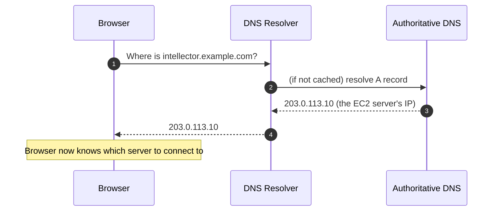

- **What's happening:** DNS is the phone book of the internet. The domain's **A record** points at your EC2 server's public IP.
- **Why it matters here:** In our deployment, that DNS record *must* exist and point at the server **before** you start the stack — because **Caddy** contacts Let's Encrypt to get an HTTPS certificate, and Let's Encrypt verifies you control the domain by connecting back to it. No DNS → no certificate → no HTTPS.
- **Junior tip:** DNS results are cached (by the OS, the browser, and resolvers) using a "TTL". That's why a DNS change can take minutes to propagate.

---

## 2. Browser — TLS handshake and the first request

Now the browser opens a connection to that IP on **port 443** (HTTPS).

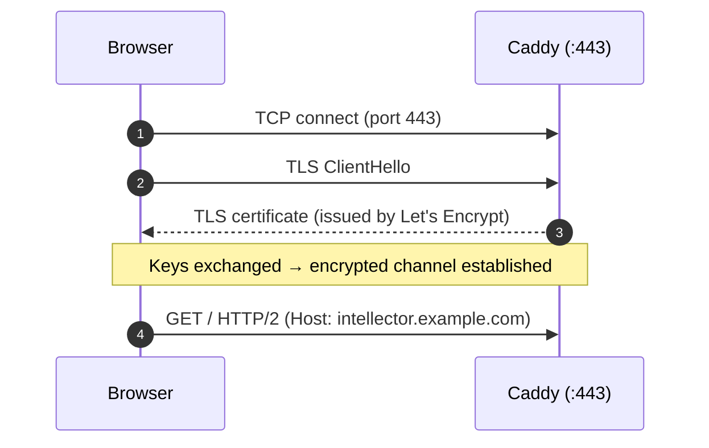

- **TLS handshake:** the browser and Caddy agree on encryption keys so nobody in the middle can read the traffic. Caddy presents the certificate it obtained for `APP_DOMAIN`.
- **Why HTTPS is non-negotiable here:** our login cookie is marked **`Secure`** in production, which means the browser will only send it over HTTPS. No HTTPS → the session cookie never travels → the user looks perpetually logged out. (This is exactly the "No TLS" risk called out in the audit.)
- **The browser also carries cookies:** if the user logged in before, the request automatically includes `Cookie: better-auth.session_token=...`. The browser attaches it for us — we don't have to do anything.

---

## 3. Caddy — the reverse proxy (the front door)

Caddy is the only service exposed to the internet. Its job is small but important.

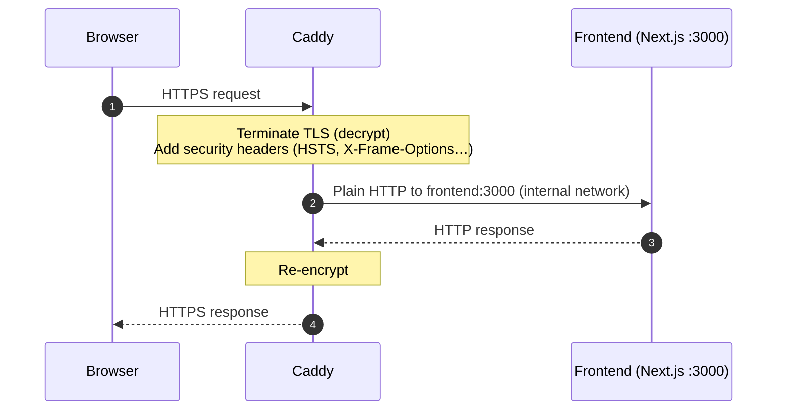

- **"Terminate TLS"** means Caddy decrypts the request here, at the edge. Everything *inside* the Docker network is plain HTTP — but that's fine because it's a private network no one outside can reach.
- **Reverse proxy** = a server that forwards requests to another server on the client's behalf. The browser thinks it's talking to one server; really Caddy is relaying to the frontend.
- Caddy also adds hardening headers (HSTS, `X-Content-Type-Options`, etc.) from our `Caddyfile`.

---

## 4. Frontend (Next.js) — two very different responsibilities

The frontend does **two jobs**, and it's crucial to understand they're separate:

### Job A — serve the UI (pages)
For a normal page load (`GET /`, `GET /login`, `GET /[slug]/home`), Next.js renders React and sends HTML/JS back. The browser then runs the React app.

### Job B — proxy API calls to the backend
When the React app needs data or a prediction, it calls a path like `POST /api/v1/prediction/sgpa/`. Next.js is configured (in `next.config.ts`) to **rewrite** anything starting with `/api/v1/` and forward it to the backend.

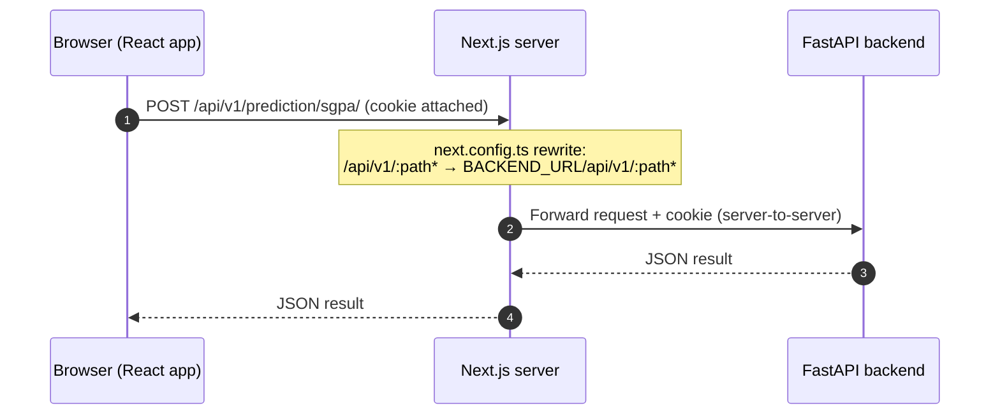

**Why proxy instead of calling the backend directly from the browser?** Three reasons a junior should internalize:
1. **Security:** the backend is never exposed publicly — only the frontend can reach it (they're on the same private Docker network, `http://api:8000`).
2. **Same-origin cookies:** because the browser thinks everything is on `intellector.example.com`, the `SameSite=Lax` session cookie is included automatically. If the browser called the backend on a different origin, the cookie would be dropped and auth would fail.
3. **No CORS headaches** for the browser (the server-to-server hop isn't subject to browser CORS).

> **Detail that fixed a real bug:** `skipTrailingSlashRedirect` in `next.config.ts`. FastAPI expects a trailing slash on some routes. Without this setting, Next.js would issue a redirect that could *drop the session cookie*, causing random "Authentication required" errors. The rewrite deliberately preserves the trailing slash.

> **Build-time gotcha:** `BACKEND_URL` is baked into the frontend when the image is **built**, not when it runs. That's why our Dockerfile requires it and the build fails loudly if it's missing.

The frontend *also* talks to the database directly for some things (login via Better Auth, RBAC lookups, tenant provisioning) using Drizzle ORM — but for ML/chatbot work, it's purely a proxy.

---

## 5. Backend (FastAPI) — the middleware pipeline

The request now arrives at FastAPI. Before your endpoint code runs, the request passes through a **pipeline** of middleware and dependencies. Order matters.

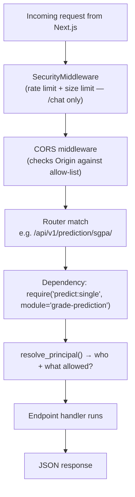

Step by step:
1. **SecurityMiddleware** — for **chatbot** requests only (`/chat`), enforces a rate limit (30 requests/minute per client) and a max body size (10 KB). Other endpoints skip it. *(In-memory today; the code notes Redis for multi-instance production.)*
2. **CORS middleware** — checks the browser `Origin` against `CORS_ALLOW_ORIGINS`. Because we allow credentials (cookies), `*` is not permitted — we use an explicit allow-list.
3. **Routing** — FastAPI matches the URL to a router (e.g. the SGPA predictor).
4. **Authorization dependency** — every protected router is wrapped in `Depends(require(permission, module))`. This runs **before** your handler. If it raises 401/403, the handler never executes.
5. **Handler** — your actual endpoint logic (fetch student, run model, etc.).

**Why a dependency for auth instead of code inside every handler?** So authorization is declared **once per route** and can't be forgotten. It's centralized, consistent, and testable. This is the FastAPI idiom — lean on it.

---

## 6. Authentication & Authorization — "who are you, and are you allowed?"

This is the heart of the backend. FastAPI doesn't run its own login system — it **trusts the same session table the frontend writes to**. One source of truth.

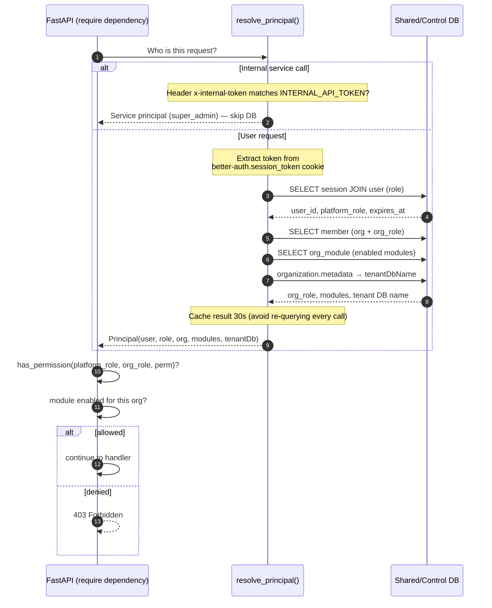

Let's unpack the important ideas:

### The "Principal"
A `Principal` is just an object answering "who is this caller?" — user id, platform role, org, org role, entitled modules, and which tenant database they belong to. Building it is the first thing every protected request does.

### Two ways to authenticate
- **Session cookie** (normal users): the cookie value is `<token>.<signature>`; we take the token part and look it up in the `session` table. We also check it hasn't **expired**.
- **Internal token** (service-to-service): when the *chatbot* calls the ML endpoints, it can't present a user cookie, so it sends a secret header `x-internal-token`. If it matches `INTERNAL_API_TOKEN`, the caller is treated as a trusted super-admin service. (This is why that token must be a strong secret — see [environment.md](environment.md).)

### Two planes of permission
Authorization asks two questions:
1. **Do you have the permission?** Granted if **either** your *platform role* (`super_admin`, `support`, …) **or** your *org role* (`owner`, `admin`, `analyst`, `mentor`, `viewer`, …) grants it. Rules live in `matrix.py` (backend) mirrored by `rbac.ts` (frontend), kept in sync by a test.
2. **Is the module enabled for your organization?** Even if you *can* run predictions, your org must be **entitled** to that module (`org_module.enabled`). This is the SaaS "which features has this customer paid for" switch.

### Caching
Resolving a principal hits the DB several times, so results are cached in-memory for **30 seconds** per token. This keeps a burst of requests from hammering the auth tables. Trade-off: a permission change can take up to 30s to take effect.

---

## 7. Database — routing to the correct tenant

Once we know *who* the user is, we know *which database* holds their data. This is the multi-tenant magic.

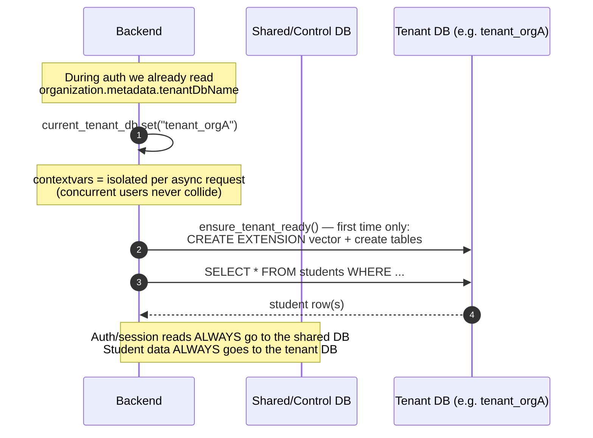

Key concepts for a junior:
- **`contextvars`** — think of it as a variable that's *private to the current request*, even though many requests run concurrently on the same event loop. We stash the tenant DB name there so that any code deeper in the call stack automatically uses the right database. No need to pass the tenant name through every function.
- **Connection pools** — opening a DB connection is expensive, so we keep a reusable pool. There's one pool for the shared DB and **one pool per tenant**. (This is why pool sizes are tunable — too many tenants × too-big pools can exhaust Postgres connections.)
- **Lazy schema creation** — the first time we touch a tenant DB in this process, we create the `pgvector` extension and tables (`ensure_tenant_ready`). After that it's a no-op.
- **The golden rule:** accounts/permissions → **shared** DB; student data + chat memory → **tenant** DB. Never mix them up.

---

## 8. AI Components — predictions and the chatbot

There are two flavors of "AI" and they behave very differently.

### 8a. Fast ML predictions (no LLM)
For an SGPA/career/9-box/subject prediction, the backend loads a pre-trained **CatBoost** model (a `.cbm` file) into memory at startup and runs it. This is pure math — milliseconds, no network, no external API.

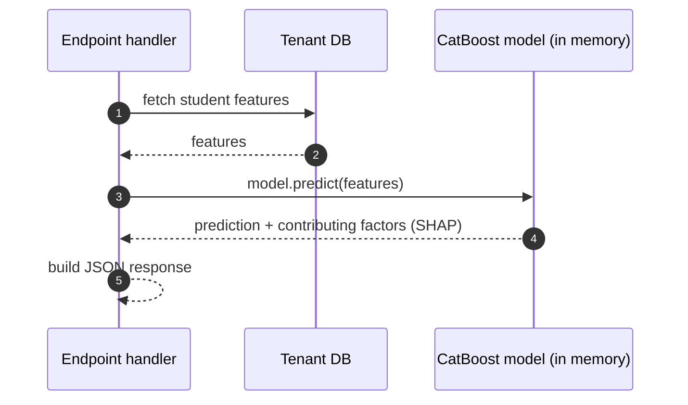

### 8b. The chatbot (uses the local LLM)
The chatbot is more involved. The user sends a message; a **LangChain orchestrator** decides what to do, possibly calling the **Ollama** LLM to interpret intent, then invoking **tools** (which are really just calls back into our own ML endpoints).

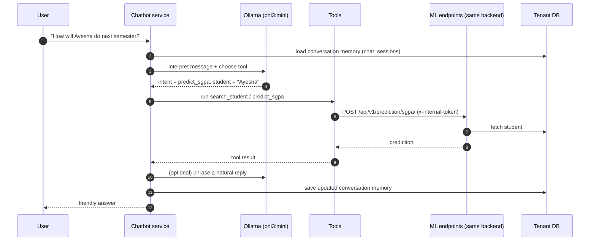

Things to notice:
- **The chatbot calls our own API using the internal token** — that's the service-principal path from §6. It's the app talking to itself as a trusted client.
- **Conversation memory** lives in the tenant's `chat_sessions` table (selected student, last intent, pending fields), so the bot remembers context across messages.
- **Graceful degradation:** if Ollama is down, the code logs a warning and uses a fallback rather than crashing. AI being unavailable should never take down the whole request.
- **Semantic search:** finding "Ayesha" uses pgvector embeddings + fuzzy text matching, so the bot can match approximate names.

---

## 9. External services — what's actually "external"?

A useful clarification for a junior: in this system, most "services" are **internal containers**, not third-party APIs.

| Service | Internal or external? | Notes |
|---------|----------------------|-------|
| PostgreSQL | Internal container | Same Docker network |
| Ollama (LLM) | Internal container | Runs locally — **no** paid AI API, no data leaves the box |
| Google OAuth | **External** (optional) | Only during "Sign in with Google" |
| Let's Encrypt | **External** (setup only) | Contacted by Caddy to issue/renew TLS certs |

So on a normal prediction/chat request, **nothing leaves your server**. The only genuinely external calls are Google login (optional) and certificate issuance (handled by Caddy in the background). That's great for privacy and latency.

---

## 10. Response flow — the journey back

The response retraces its steps in reverse. Every hop that added something on the way in, unwinds on the way out.

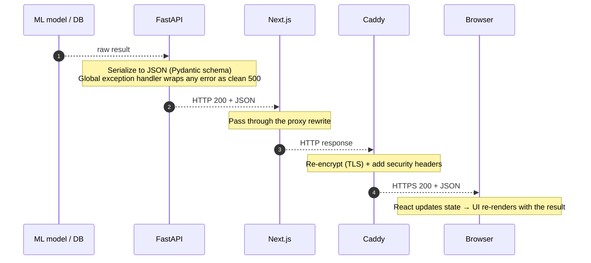

- **Serialization:** FastAPI converts Python objects to JSON using **Pydantic** response models, which also guarantees the shape of what we send.
- **Error safety:** a global exception handler turns any unhandled crash into a clean `{"error": "internal_error"}` 500 — we never leak stack traces to users.
- **Back through the proxy:** Next.js relays the JSON unchanged; Caddy re-encrypts it.
- **The browser finishes the job:** React receives the JSON, updates component state, and the UI re-renders — the user sees their prediction or chat reply.

---

## 11. The whole trip, end to end

Here's everything in one diagram — a protected prediction request from a logged-in user.

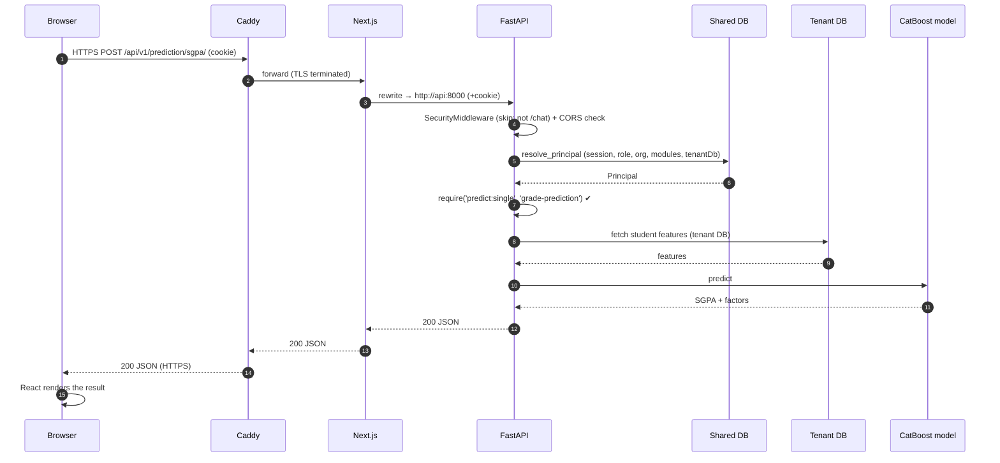

---

## 12. Recap — the ten things to remember

1. **DNS** points the domain at the EC2 server (needed for TLS too).
2. **TLS/HTTPS** is required or the secure session cookie won't be sent.
3. **Caddy** is the only public door; it terminates TLS and forwards internally.
4. **The browser only talks to the frontend**; Next.js proxies `/api/v1/*` to the backend.
5. **`BACKEND_URL` is build-time**; `skipTrailingSlashRedirect` protects the cookie.
6. **FastAPI trusts the frontend's session table** — one identity source.
7. **Two planes of permission** (platform role OR org role) **plus** module entitlement.
8. **`contextvars` routes each request to the right tenant database**; auth always uses the shared DB.
9. **Predictions are local CatBoost math; the chatbot uses local Ollama** — nothing leaves the server on a normal request.
10. **The response retraces every hop in reverse**, ending with React re-rendering in the browser.

---

*This document describes the request lifecycle as implemented in the repository today. For the static architecture see [architecture.md](architecture.md); for configuration see [environment.md](environment.md).*
